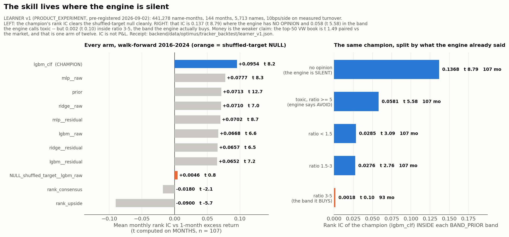
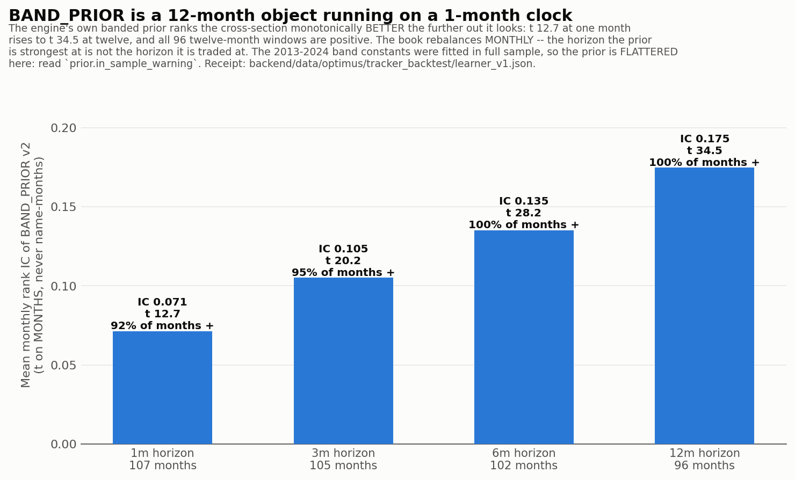
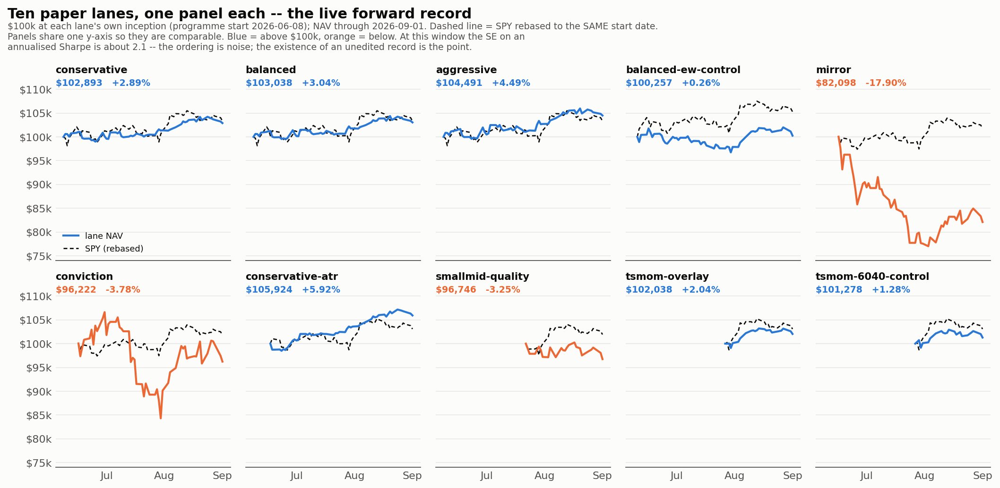
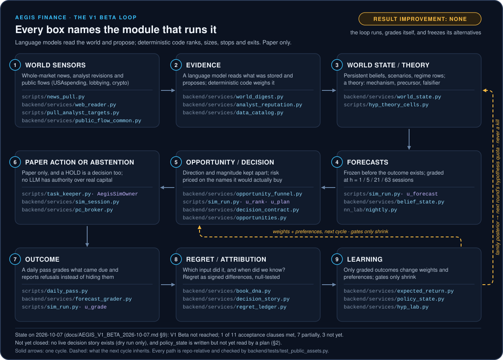
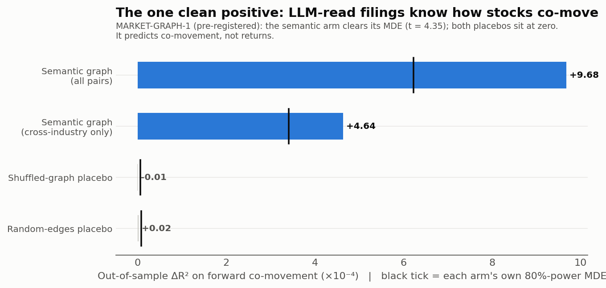
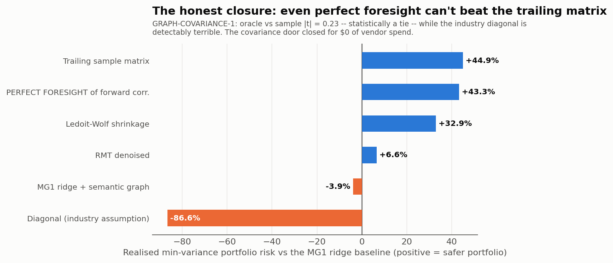
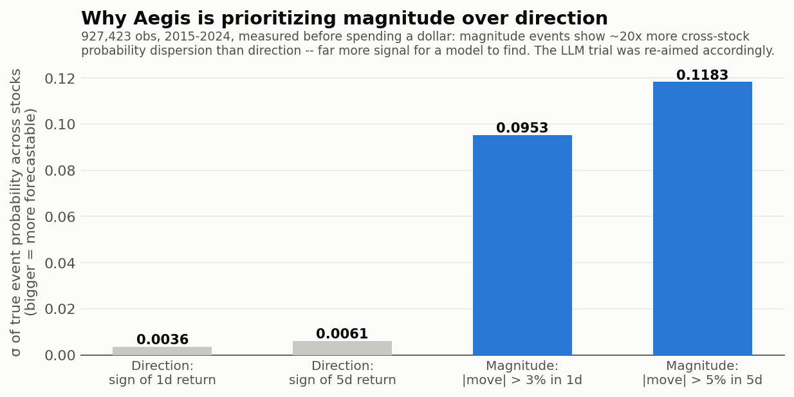
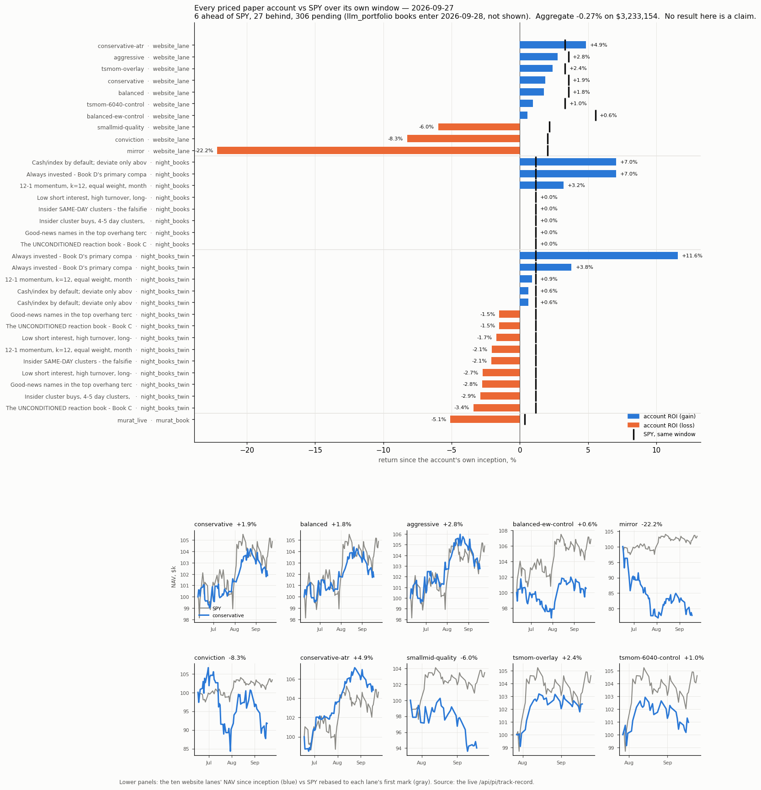

<p align="center">
  <a href="https://aegis-finance-six.vercel.app"></a>
</p>

<h1 align="center">Aegis Finance</h1>

<p align="center">
  <b>Auditable AI investment intelligence</b> — open source, paper only, a receipt behind every headline number.<br>
  It writes down what it believes before an outcome exists, grades every belief against what then happens,
  and lets only graded beliefs change how paper capital is sized.
</p>

<p align="center">
  <a href="https://aegis-finance-six.vercel.app"></a>
  
  
  
  
  
  
  <a href="LICENSE"></a>
</p>

<!-- results-panel:start -->
<p align="center">
  
</p>
<p align="center"><sub>Every number on both pictures is read from a committed receipt (<code>docs/assets/public_results_2026-10-09T045359Z.json</code>) and every stage names the code that runs it; <code>backend/tests/test_public_assets.py</code> fails if either stops being true. The motion version is <a href="docs/design/aegis_front_page.html"><code>docs/design/aegis_front_page.html</code></a>; the design record is <a href="docs/design/AEGIS_VISUAL_LANGUAGE_2026-10-07.md"><code>docs/design/AEGIS_VISUAL_LANGUAGE_2026-10-07.md</code></a>.</sub></p>
<!-- results-panel:end -->

Aegis Finance is a free, open-source **self-improving investment intelligence
system** that measures itself in public and tells you when it is wrong. Its
objective is compound return under explicit survival constraints — not
classification accuracy, not a pretty backtest — and it searches the *whole*
market rather than the famous part of it. Language models read the world and
propose causal hypotheses; deterministic code ranks, sizes, stops, exits and
grades. Results are read against a control built to be fair, and every headline
number names the JSON receipt it came from.

A paper candidate is frozen in a strategy contract before its first decision; a
public claim needs full pre-registration ([the three
licences](#three-licences--what-a-result-is-allowed-to-claim)). Results are
published whether they work or not, and the corpses are kept — the failures live
in [NEGATIVE_RESULTS.md](NEGATIVE_RESULTS.md), at the top level, where a skeptic
finds them first. The forward paper record has run since **2026-06-08**. Around
that spine sits a market dashboard (crash-risk and fragility measurement, Monte
Carlo projections, portfolio construction, factor analysis, point-in-time data
collectors), all on free data sources. The sixteen invariants in
[`docs/AEGIS_STRATEGIC_INVARIANTS.md`](docs/AEGIS_STRATEGIC_INVARIANTS.md)
outrank any roadmap in this repo.

**This is an educational tool, not financial advice.** It trades paper only; no
language model has authority over real capital, and nothing here is a claim that
Aegis beats the market.

### The evidence ladder

Every number shown to a reader carries one label, earned one rung at a time
(`LABEL_LADDER` in [`backend/services/book_dna.py`](backend/services/book_dna.py)).
**Today nothing is above `OBSERVED(n)`**; the scoreboard below says where each
number sits.

| rung | what it means | who may award it |
|---|---|---|
| `OBSERVED(n)` | a number measured over *n* sessions: a fact about the past, not evidence of skill | any receipt |
| `EARLY_EVIDENCE` | at least 21 sessions, excess over SPY above zero, and at least 2 of 3 sub-windows positive | `book_dna` |
| `REPLICATED` | `EARLY_EVIDENCE` plus a positive excess over the fair twin, or a frozen replication that also qualifies | `book_dna` (its ceiling) |
| `VALIDATED_EDGE` | a validator run once on data the idea never saw | no module awards it today |

**Read `EARLY_EVIDENCE` with its null rate.** The rule is a sign test, and a book with *no* edge meets
it about 4 times in 10 at any single look (7 in 10 at some point within a quarter of daily re-looks);
`REPLICATED` through the fair-twin clause is met by about 3 no-edge books in 10. Measured with
`book_dna`'s own functions:
[`docs/research_notes/2026-10-07/evidence_ladder_null_rate_cloud_2026-10-07.md`](docs/research_notes/2026-10-07/evidence_ladder_null_rate_cloud_2026-10-07.md);
whether the rung should change is an open owner decision.

### Live evidence pages

Base URL: **https://aegis-finance-six.vercel.app**

| page | what it shows |
|---|---|
| [`/opportunities`](https://aegis-finance-six.vercel.app/opportunities) | Opportunity Explorer: direction, magnitude and the evidence label in separate columns |
| [`/brain`](https://aegis-finance-six.vercel.app/brain) | what the system remembers, what it graded, what it decided today, and whether each part is actually running |
| [`/arena`](https://aegis-finance-six.vercel.app/arena) | every paper account and frozen book, graded against SPY over its own window; nothing on it is a claim of skill |
| [`/forecast-lab`](https://aegis-finance-six.vercel.app/forecast-lab) | how good the forecasts are, graded against what happened, each beside the baseline it must beat |
| [`/theory-lab`](https://aegis-finance-six.vercel.app/theory-lab) | every theory with a mechanism, a precursor and a falsifier; negative results listed, not hidden |
| [`/health`](https://aegis-finance-six.vercel.app/health) | verdicts derived from what each producer wrote; a stale output is red even when its process is alive |

**For funders and reviewers:** [`docs/FUNDING_EVIDENCE_PACK_2026-10-07.md`](docs/FUNDING_EVIDENCE_PACK_2026-10-07.md),
where every number was checked against the receipt it names and a number no
receipt holds says `NOT MEASURED`.

## V1 Beta scoreboard (2026-10-07)

**The live result first.** The best strategy account in each of three families is ahead of SPY over its
own window: `revision_flow_v0` +5.74 pp over 7 sessions (its matched random twin: −1.41 pp), night book
`b109c886` +3.90 pp over 17, and `hack2`, a real Alpaca paper account holding the same 20 names, +1.02 pp
over 27, the one book with 21 or more sessions that is ahead. That is a few weeks of paper, picked after
the fact from 307 priced accounts, so each number carries its label. On the survivorship-free historical
panel, alpha is not demonstrated yet. What exists is a loop that runs, grades itself, freezes the
alternatives it did not take, and reads every result against a control built to be fair. Every number
below names its receipt (paths under `backend/data/optimus/`) and carries an evidence label; the ladder is
`OBSERVED(n)` → `EARLY_EVIDENCE` → `REPLICATED` → `VALIDATED_EDGE`, and nothing here is above `OBSERVED(n)`.

| line | value | label | receipt |
|---|---|---|---|
| Historical, CRSP 1991-2024 (survivorship-free) | On the sticky twin (cost-fair by construction): 44 of 277 rules reach fair-twin t >= 2, 40 also pass pure selection, **1** also beats the market in validation and fails pure selection there (t 1.16). **Historical alpha: not demonstrated.** | `BACKTEST-ONLY` | `hyp_lab/twin_board_SUMMARY_STK_2026-10-07_2.json` |
| Paper estate | 362 priced books; 101 ahead of SPY over their own window, 206 behind. The 101 are 76 control twins, 0 controls and 25 strategy books worth about **2.6 independent ex-ante bets** (the largest holdings cluster, 5 books including revision_flow_v0 and hack2, is one basket). **One** book with >= 21 sessions is ahead: hack2, +1.02 pp over 27 sessions. | `OBSERVED(n)` | `paper_accounts/roi_2026-10-06T235345Z.json`; `paper_accounts/book_dna_2026-10-06T235345Z.json` |
| Website lanes (since June) | all 10 behind SPY over their own windows (−1.39 pp to −28.26 pp) | `OBSERVED(n)` | `paper_accounts/roi_2026-10-06T163850Z.json` |
| $1M paper account (PC-PAPER) | +0.27% vs SPY +0.86% since 2026-09-22, holding 79.85% cash; a worst-case gate priced on the names it would buy (14.08% of equity vs a 10% limit) caps the active sleeve at 54% gross | `OBSERVED(n)` | `pc_mandate/reconcile_2026-10-06_147824639837.json` |
| Live loop | a scheduled owner starts a paper session on US trading days; candidate set refreshed 2026-10-06 (25 names, 2 eligible); positions still UNRECONCILED with the contract | `OBSERVED` | `health/health_20261006T175305Z.json` |
| Learned models | nn_lab's network does not beat ridge or LightGBM at any horizon; no model holds forward weight | `OBSERVED` | `nn_lab/receipts/wf_20261007T_c5_review.json` |
| LLM spend (DeepSeek, the only provider) | balance $17.87 on 2026-10-06; $16.03 spent since 2026-09-27 by the provider's own balance | `OBSERVED` | `deepseek_balance.jsonl`; `python -m scripts.llm_cost_audit --snapshot` |

**V1 Beta is not reached yet:** of the eleven clauses in the roadmap's definition, 1 is met, 7 partially, 3
not yet. The clause-by-clause table, the pipeline diagram with every box's live module and receipt, what
we can and cannot claim, and the review loop (every build attacked by a second model, scores 56-70) are in
**[`docs/AEGIS_V1_BETA_2026-10-07.md`](docs/AEGIS_V1_BETA_2026-10-07.md)**. The plan is
[`docs/ROADMAP_2026-10-06_V1_BETA_THE_LOOP_THAT_LEARNS.md`](docs/ROADMAP_2026-10-06_V1_BETA_THE_LOOP_THAT_LEARNS.md);
the funding evidence pack is
[`docs/FUNDING_EVIDENCE_PACK_2026-10-07.md`](docs/FUNDING_EVIDENCE_PACK_2026-10-07.md).

## Start here — the skim → read ladder

Five rungs. **Stop at the one that answers your question**; each is a strict
superset of the one above it. This is the same ladder for a human skimming on a
phone and for an agent about to change something.

| Rung | Read | Cost | You leave knowing |
|---|---|---|---|
| **1** | this README | 5 min | what Aegis is, the headline results, what it refuses to claim |
| **2** | [`docs/INDEX.md`](docs/INDEX.md) | 3 min | which of 268+ docs answers your question |
| **3** | **TIER 0** — [invariants](docs/AEGIS_STRATEGIC_INVARIANTS.md) · [the vision, verbatim](docs/AEGIS_VISION_2026-08-28_MURAT_IN_HIS_OWN_WORDS.md) · [objective §0](docs/OPTIMUS_OBJECTIVE.md) · [CLAUDE.md](CLAUDE.md) | 30 min | the constraints that outrank every plan |
| **4** | the **ONE** current TIER 1 roadmap (INDEX names it; today [`ROADMAP_2026-10-06_V1_BETA_THE_LOOP_THAT_LEARNS.md`](docs/ROADMAP_2026-10-06_V1_BETA_THE_LOOP_THAT_LEARNS.md)) and the public story [`AEGIS_V1_BETA_2026-10-07.md`](docs/AEGIS_V1_BETA_2026-10-07.md) | 30 min | what is being built now and what gates it |
| **5** | **the receipt** named beside the number | varies | whether the number survives being looked at |

**Rung 5 is not optional for a number you are about to act on.** Every headline
in this repo names a JSON receipt; prose is the summary, the receipt is the
fact. A number that lives only in prose has already burned us once (`corr =
0.516` turned out to be a filtered subset nobody had named).

**Agents, additionally:** run `session_briefing()` + `aegis_verified_state()`
(Optimus MCP) *before* reading code, and `brain_query` / `aegis_postmortems`
*before* proposing any research — the idea may already have a corpse with
receipts. Big datasets that are deliberately **not** committed are catalogued in
[`docs/DATA_MANIFEST.md`](docs/DATA_MANIFEST.md); check there before concluding
something was never pulled. Execution — the six live paper books — is a
**separate repo**, entered at `aegis-alpha-terminal/docs/INDEX.md`. There is no
`docs/HANDOFF.md` in this repo, on purpose.

## Three licences — what a result is allowed to claim

The single most useful thing this project did in 2026 was stop applying one
evidence standard to everything. Research rigour determines what Aegis is
allowed to **claim**; it must not determine what Aegis is allowed to **test** in
paper. Every artefact here names one of these:

| Licence | Permits | Required before it starts | Significance gate? |
|---|---|---|---|
| `PRODUCT_EXPERIMENT` | internal simulation + external **paper** brokerage | a frozen strategy contract *before the first decision*: policy hash, timestamp, inputs, costs, fill convention, objective | **No.** No MDE, no multiplicity control, no 24-month floor |
| `CAPITAL_CANDIDATE` | candidacy for **real money** | matured forward evidence, realistic costs, calibration, utility improvement, drawdown/ruin bounds | Yes — and promotion stays **attended** by a human |
| `RESEARCH_CLAIM` | a public skill claim or a paper (nothing here holds it; alpha: not demonstrated) | full pre-registration, MDE, multiplicity control, matched controls, holdout | Yes — every standing evidence rule binds |

Four things never relax at any licence, and they are enforced in code rather
than by intention: **no information acted on before it was public**; **no target
leakage**; **costs are never omitted** (`portfolio_farm.Policy` *refuses* zero
costs unless `zero_cost_diagnostic=True`, and the flag travels onto every result
row); and **once a candidate enters forward paper, its version is frozen**.
No LLM ever has authority over real capital.

## Live

| Surface | URL |
|---|---|
| Web app | https://aegis-finance-six.vercel.app |
| API | Railway (FastAPI backend, auto-deployed from `main`) |
| Optimus brain showcase | https://optimus-brain-alpha.vercel.app |

**Pages in the web app:** `/opportunities` · `/brain` · `/arena` · `/forecast-lab` · `/theory-lab` · `/health`; what each shows is in [Live evidence pages](#live-evidence-pages) at the top.

**Paper accounts:** see the [V1 Beta scoreboard](#v1-beta-scoreboard-2026-10-07) above. Every row: [`docs/PAPER_ACCOUNTS.md`](docs/PAPER_ACCOUNTS.md) · [details](#the-track-record-precisely) · `GET /api/pi/paper-accounts`. None of it is a claim.

## The newest results (September 2026)

*Every figure below is generated from the frozen run artifacts and the live API
by [`tools/readme_charts.py`](tools/readme_charts.py) — numbers are read from
JSON, never retyped. Regenerate with `python tools/readme_charts.py`.*

### 1. The skill lives where the engine is silent

🔵 **BACKTEST · `PRODUCT_EXPERIMENT`** — receipt:
[`backend/data/optimus/tracker_backtest/learner_v1.json`](backend/data/optimus/tracker_backtest/learner_v1.json)



LEARNER v1 asked whether a machine-learned model can add anything on top of the
engine's own banded prior. It was pre-registered on 2026-09-02 *before any model
was fitted*, then run walk-forward over **441,278 name-months / 144 months /
5,713 names**, twelve arms, with a shuffled-target null running the identical
pipeline. Three things came out, and only one of them is a good headline:

- **The ordering clears its null.** Champion `lgbm_clf` reaches mean monthly rank IC
  **0.0954, t 8.21** (t on months, n = 107) while the shuffled-target null sits
  at **0.0046 (t 0.81)**. The null is clean.
- **The money is not demonstrated.** The champion's top-50 value-weighted book is
  **t 1.49** paired against the market. That is one arm of twelve, on one draw
  of a correlated set. *IC is not P&L*, and this README does not claim it is.
- **The interesting result is conditional.** Split by the engine's own bands,
  the champion's IC is **0.137 (t 8.79)** where the engine has **no opinion**,
  **0.058 (t 5.58)** in the band the engine calls toxic — and **0.002 (t 0.10)**
  inside ratio 3–5, *the band the engine actually buys*. The learner is not
  improving the engine's picks. It is seeing in the dark where the engine is
  blind.

### 2. The prior is a 12-month object running on a 1-month clock

🔵 **BACKTEST** — same receipt (`scoreboard_other_horizons.prior`)



The engine's banded analyst-target prior ranks the cross-section monotonically
*better* the further out you look — **t 12.7 at one month rising to t 34.5 at
twelve**, with all 96 twelve-month windows positive. The live books rebalance
**monthly**. A signal being strongest at a horizon nobody trades it at is a
construction bug, not a discovery, and the trial that separates "twelve-month
prior sampled too often" from "beta exposure wearing a selection label" is
running now (`scripts/band_horizon_run.py`, `PREREG_BAND_IS_BETA_1`).
⚠ The 2013–2024 band constants were fitted in full sample, so the prior is
**flattered** in this chart — read `prior.in_sample_warning` in the receipt
before quoting it.

### 3. The forward record, unedited

🟢 **LIVE FORWARD** — source: the public
[track-record API](https://aegis-finance-production.up.railway.app/api/pi/track-record)



Ten paper lanes, $100k each, marked daily since **2026-06-08**, configs
hash-pinned so tampering is detectable. **The ordering here is noise** — at this
window the standard error on an annualized Sharpe is about 2.1, which is wider
than every gap on the chart, including the gap to SPY. What is *not* noise is
that the record exists and cannot be edited backwards. The deeply underwater
`mirror` lane stays on the chart on purpose: it is this project's own receipt
for what concentrated idiosyncratic risk does to a book.

### 4. What a month of data buying actually bought

🔶 **EXPLORATORY** — receipt:
[`backend/data/optimus/tracker_backtest/month_retro_20260902.json`](backend/data/optimus/tracker_backtest/month_retro_20260902.json)
· writeup: [`docs/RETRO_2026-09-02_THE_MONTH_OF_DATA.md`](docs/RETRO_2026-09-02_THE_MONTH_OF_DATA.md)

August 2026 acquired roughly **6.0 GB across 31 dataset families**. Only
**12,233 rows** of it are point-in-time-clean *forward* observations; everything
else is substrate or hindsight. The month's largest single loss was a name our
own rule had **refused** (`claims: false`, rank 576 of 766) and the book held at
10% anyway — and it was the only company-specific loss that day. The other
twelve holdings were leverage: **mean market beta 2.10** into a −0.687% SPY.
Two forward sessions exist; n = 2 decides nothing. That is the honest state.

Related, same window: holder-provenance H2/H3 on the full 13F panel
([`holder_h2_h3.json`](backend/data/optimus/tracker_backtest/holder_h2_h3.json))
found holder identity **thin** (t 2.24, ~5 bps per 1sd — under costs), the
long-duration-holder intuition **inverted**, and a manager's own top-decile
stake **adverse** (−1.21pp per 252 sessions, t −3.95). Three intuitions, three
adjudications, none of them the one we expected. That is the system working.

## The honesty machine

Most retail finance tools show you a backtest and ask you to trust it. Aegis assumes backtests lie (ours did — see below) and runs the discipline instead:

- **Pre-registered trials.** Every signal, strategy, or overlay gets a written hypothesis, primary metric, decision rule, and earliest decision date *before* it accrues data (`docs/TRIALS/`). If it isn't pre-registered, it didn't happen.
- **Forward paper lanes.** Ten paper portfolios ($100k each) marked to market daily since inception **2026-06-08**: four reference lanes (conservative, balanced-HRP, aggressive, equal-weight control), two book lanes (mirror + conviction), an ATR exit-overlay lane, a small/mid-quality lane, and a TSMOM overlay pair (treatment + 60/40 control). NAV accrues only with elapsed time and cannot be cherry-picked.
- **Decision clocks, not vibes.** TRIAL-001 (HRP vs equal-weight) reads out no earlier than **June 2027**. The project makes **no skill claims before 24 months** of forward record. Period.
- **Published negative results.** The signal engine *loses* to buy-and-hold as a timing tool. The 12-month crash model has no skill. LPPLS bubble timing was refuted twice. A survivorship-free backtest universe is not buildable on free data — so a backtest on the free vendor panel cannot carry a skill claim, and we say so; the survivorship-free re-runs use CRSP. [Read them all.](NEGATIVE_RESULTS.md)
- **Overfitting guards — themselves calibrated.** Deflated Sharpe, PBO, Harvey-Liu thresholds, and purged cross-validation are computed for every candidate. In Aug 2026 we ran the whole decision ladder against synthetic markets with *known* injected edges (GATE-M1) and found our own gates had ~0% power — so the ladder was recalibrated to a **measured** 1.6% false-discovery rate, with DSR/PBO reported as diagnostics rather than pretending they gate ([NEGATIVE_RESULTS §34](NEGATIVE_RESULTS.md)). Even a "pass" goes to human review, never auto-adoption.

Every idea walks the same gauntlet — and most die, cheaply and on the record:

<p align="center">
  
</p>

## The brain, in one picture

The system is converging on a specific architecture: **the LLM perceives, the
engine computes, learned models forecast, Aegis referees, and reality grades
everyone** — in a loop. Every card names the modules that run its stage; the
blue current is one cycle, the orange path is what the next cycle inherits.

<p align="center">
  <a href="docs/assets/architecture_pipeline.svg"></a>
</p>

## How to read the evidence here

This project mixes four very different kinds of evidence, and confusing them
is how finance projects mislead people. Every claim on this page carries one
of these badges:

| Badge | Meaning |
|---|---|
| 🟢 **LIVE FORWARD** | Happened *after* the rule was frozen. No hindsight possible. |
| 🟡 **FORWARD TRIAL** | Pre-registered experiment currently collecting evidence — verdict pending. |
| ⚪ **ARMED** | Machinery built and pre-registered, but **nothing has accrued yet**. Distinct from 🟡 on purpose: "the apparatus runs" and "evidence is arriving" are different claims, and conflating them is how a project sounds further along than it is. |
| 🔵 **BACKTEST** | Historical simulation. Useful for direction-finding, vulnerable to hindsight. Never a skill claim here. |
| 🟣 **ORACLE** | A deliberately *impossible* benchmark that is allowed to see the future. Measures the ceiling on how valuable an information source could ever be — not performance. |
| 🔴 **REFUTED** | Tested and failed its pre-defined bar. Kept public. |
| 🔶 **EXPLORATORY** | Interesting observation, not yet evidence. |

## The story so far, in one paragraph

We built a market timer 🔵. It detected danger correctly — and still lost
badly to buy-and-hold, because *recognizing risk* and *predicting returns*
turned out to be different problems. So we rebuilt the project around finding
where useful information actually lives: measurement showed **magnitude and
risk look far more forecastable than direction**; an LLM reading SEC filings
turned out to know **how companies are economically connected** in ways price
history doesn't 🟡→✅; an oracle test 🟣 then showed one obvious use of that
knowledge (better covariance matrices) is a dead end even with perfect
information — so the live experiments now test the uses that remain. Paper
portfolios 🟢 are the test of whether any of it makes money; so far none has
shown that it does. No verdict before its clock.

## Scoreboard — what the research has actually established (through Aug 2026)

The questions this project has spent real compute answering, with the honest
verdicts. Receipts for every row live in [`docs/`](docs/README.md).

| Question | Verdict | Receipt |
|---|---|---|
| Can an LLM pick stocks directly? | 🔴 No evidence — measured role: presentation & research assistance | 16,320 graded decisions 🔵; ablation p=0.105–0.185; ~40% of apparent effect reproduced by permuted noise |
| Do 14 specialist LLM personas beat one generic agent? | 🔴 No — retired | 0.49 vs 0.85 effective distinct ideas, at 5.2× the calls |
| Does the LLM know **economic relationships** the correlation matrix doesn't? | ✅ **Yes — the campaign's one clean positive** 🔵 (architecture result, not a trading claim) | MARKET-GRAPH-1: t = 4.35 vs its own MDE, every placebo intact |
| Does that graph improve a covariance/risk model? | 🔴 Closed, for $0 — even a cheating model that *sees* future correlations ties the ordinary trailing matrix 🟣 | GRAPH-COVARIANCE-1: oracle vs sample \|t\| = 0.23; industry diagonal −86.6% |
| Does autonomous internet investigation beat a data snapshot? | ⚪ **Armed — first valid night pending (0/40 graded).** Night 1 spent $0.066 and VOIDed itself on its own information guard; nothing has accrued | INTERNET-INVESTIGATOR-FWD-1 · [receipt](backend/data/optimus/iif1_nights/2026-08-14.json) |
| Do public actors' disclosed trades carry structure? | ⚪ **Paper lanes seeded — production ingestion pending.** 2 lanes live, 12 declared inactive; no production collector yet, so no new teacher signal can arrive | Track E + COPY-LAB |
| Where does Aegis currently see the strongest forecasting opportunity? | 📐 **Magnitude, volatility and risk appear substantially more promising than return direction** — three independent measurements point the same way | exposure-oracle gap 🟣 · covariance closure 🟣 · σ_π decomposition 🔵 |
| When a decision failed, can Aegis say *where* it failed? | ⚪ **Machinery built, first dataset dissected.** Every decision becomes an episode replayed under 17 alternative policies; failures are classified perception / inference / action / timing / sizing / cost | [RESEARCH-GYM-1](docs/RESEARCH_GYM_1.md) — **Gym output is never evidence**, by charter and by a type that refuses to render as a claim |

### The findings, in pictures

*Same generator as the September figures above:
[`tools/readme_charts.py`](tools/readme_charts.py) — numbers are read, never retyped.*





<details>
<summary><b>What is an "oracle" and why test one? (plain English)</b></summary>

An oracle 🟣 is a deliberately **impossible** model — it's allowed to see the
future. It is not Aegis, not a strategy, and can never be traded. Its job is
to answer one question before money gets spent: *even if God told us this
particular variable, would knowing it actually help?*

Weather-stand version: before spending six months building a temperature AI
for your ice-cream stand, hand the system *tomorrow's actual temperature*.
If profits barely move, temperature wasn't the valuable information — no
forecaster can beat the oracle that already knew the answer.

Aegis has run this test twice, with opposite answers:

- **Covariance oracle** (chart above): a portfolio built with *perfect
  knowledge of future correlations* was statistically **tied** with one
  built from ordinary trailing history (\|t\| = 0.23). Verdict: stop
  researching correlation predictors for this objective — the information
  itself isn't worth enough. Door closed for $0.
- **Exposure oracle**: knowing *when to take market risk* was worth
  **+21.6 pp/yr** — over ten times its detection bar — but our best
  real-world (non-cheating) controller captured only ~7% of it. Verdict:
  the information is enormously valuable and remains mostly uncaptured —
  keep researching.

Same test, two doors: one closed forever, one confirmed worth walking
through. That's what oracles are for.

</details>



<details>
<summary><b>What does "magnitude vs direction" mean? (plain English)</b></summary>

**Direction** asks: *which way* will the stock move? ("NVDA will be UP over
the next 5 days.")

**Magnitude** asks: *how big* will the move be, either way? ("NVDA will
probably move more than 5% this week" — +8% and −8% both count.)

The chart shows why the distinction matters: across 927,423 stock-day
observations, the true probability of a big move varies hugely from stock to
stock (some names have a 5% chance of a >5% week, others 44%), while the
probability of an *up* move barely varies at all (roughly 52% for
everything). Simply: **predicting whether a stock will move a lot appears
much easier than predicting whether it moves up or down.**

Knowing magnitude without direction is still valuable — it drives position
sizing, options pricing, risk limits, hedging, stop distances, and expected
drawdown. And if any other signal supplies even a weak directional lean,
magnitude multiplies its value. This is why the project moved from "AI
predicts BUY/SELL" toward "AI + numeric models describe the *distribution*
of what might happen."

</details>

## Historical backtests: what survived the survivorship-free panel

> 🔵 **HINDSIGHT BACKTEST — NOT FORWARD PERFORMANCE.** Every library rule was written down in 2026, after every month it is scored on. The quotable record starts at registration; forward results live in `docs/BRIDGE.md`.

In late September the strategy library (288 rules) was first scored on a vendor price panel, and that
board printed large 2024-26 returns over SPY. The panel turned out to be selected on 2026 liquidity, which
is survivor selection by construction, so those figures are not repeated here
([`docs/HANDOFF_2026-09-29_THE_DAY_THE_BACKTESTS_DIED.md`](docs/HANDOFF_2026-09-29_THE_DAY_THE_BACKTESTS_DIED.md)).
The run itself stays on the record: `backend/data/optimus/strategy_library/leaderboard_2026-09-27T082553Z.json`
at commit `6b70c553`.

Re-run on CRSP 1991-2024 (survivorship-free):

- **2026-09-29:** 133 library rules, **0** pass the deflated Sharpe; the momentum lead is +0.10%/month over
  its matched twin, t 0.33 (same handoff).
- **2026-10-07, sticky twin** (a control that shares its rule's turnover and pays the same cost model):
  301 rules, 277 scored, 24 refused by name; 44 reach fair-twin t >= 2; 40 of those also pass pure
  selection; 1 (`qc761_ebit_ev_ebit_ic_large_annual`) also beats the market in validation (2009-2016), and
  its pure-selection t there is 1.16 with 2009 carrying its market line
  (`backend/data/optimus/hyp_lab/twin_board_SUMMARY_STK_2026-10-07_2.json`;
  [`sticky_twin_2026-10-06.md`](docs/research_notes/2026-10-06/sticky_twin_2026-10-06.md)).
  **Historical alpha on CRSP: not demonstrated.**

The September leads were frozen as forward paper books with matched twins; the first 21-session reading
is the 2026-10-26 close (`docs/BRIDGE.md`). The full library run that produced those leads, number by
number, is below (the timing-strategy history that used to open this section now closes it).

## Historical backtests: what worked, what didn't

> 🔵 **HINDSIGHT BACKTEST — NOT FORWARD PERFORMANCE.** Every rule below was written down on 2026-09-26, after every month it is scored on. The quotable record starts at registration. Receipt for every number in this section: `backend/data/optimus/strategy_library/leaderboard_2026-09-27T082553Z.json` at commit `6b70c553` (run `2026-09-27T082553Z`; rendered as `backend/data/optimus/strategy_library/LEADERBOARD.md`, which the next run refreshes -- the receipt it cites is never overwritten); forward results: `docs/BRIDGE.md`.

The strategy library (288 rules in 35 families, 868 cells at k = 10/20/50 plus each rule's own k) was run on survivorship-free bars net of a band round-trip cost, with a split declared in code before the ranking: **dev** = monthly periods entered through 2023-12-31, and the **2024-26 selection window (split declared, data seen)** = entered from 2024-01-01 (32 monthly blocks). Every rule was written in 2026, so the second window is where the board SORTS, not a holdout. Sorted by net return vs SPY in that window (`backend/data/optimus/strategy_library/leaderboard_2026-09-27T082553Z.json`, `top_by_sealed_vs_spy`):

| rule (k=20) | dev CAGR | SPY dev | 2024-26 CAGR | SPY 2024-26 | 2024-26 − SPY | DSR (868 cells) | LOO-worst mean active/mo (hold-month key) | top-5-month share | max DD |
|---|---:|---:|---:|---:|---:|---:|---:|---:|---:|
| `mom_12_1_liqw` | +7.0% | +13.2% | +89.4% | +21.0% | **+68.4%** | 0.033 | +1.05% | 0.91 | -70.6% |
| `qc372_oversold_snapback_mega` | +12.2% | +13.2% | +80.4% | +21.0% | **+59.4%** | 0.070 | +0.92% | 0.52 | -68.7% |
| `rd_intensity` | +17.1% | +13.2% | +76.5% | +21.0% | **+55.5%** | 0.023 | +1.33% | 0.60 | -62.3% |
| `rev_5d` | +2.8% | +13.2% | +69.4% | +21.0% | **+48.4%** | 0.005 | +0.63% | 1.08 | -66.5% |
| `qc623_mom63_liquidity_weighted` | +12.2% | +13.2% | +67.3% | +21.0% | **+46.3%** | 0.025 | +0.70% | 0.74 | -58.9% |
| `mom_12_1_q` | +34.2% | +13.2% | +58.9% | +21.0% | **+37.9%** | 0.198 | +1.81% | 0.44 | -35.9% |
| `margin_mom` | +13.5% | +13.2% | +58.8% | +21.0% | **+37.8%** | 0.035 | +0.62% | 0.58 | -51.3% |
| `skill_mom` | +17.9% | +13.2% | +58.0% | +21.0% | **+37.0%** | 0.099 | +0.79% | 0.40 | -27.3% |
| `qc395_sharpe252_above_trend_large` | +26.8% | +13.2% | +56.2% | +21.0% | **+35.2%** | 0.114 | +1.30% | 0.48 | -32.6% |
| `co03_reversal_in_high_margin` | +12.5% | +13.2% | +55.9% | +21.0% | **+34.9%** | 0.018 | +0.61% | 0.66 | -52.9% |

LOO-worst is keyed on the month the money was HELD (review 2026-09-27 §4b: the factory keyed it on the decision date, one month early); 29 rules change their LOO-worst > 0 verdict under the correct key (`backend/data/optimus/signal_structure/leaderboard_2026-09-27T082553Z.rekeyed.json`, `changed.loo_verdict`).

**The benchmark.** The survivorship-free panel itself tilts small (random controls' IWM beta 0.65-0.92, full window), so "vs SPY" understates every rule by the panel's own tilt: SPY is the hurdle for "should Murat own it", the random panel the one for "does the signal select". **69 / 119 / 139 of 288 rules beat SPY / IWM / the random panel in both windows** (`backend/data/optimus/signal_structure/leaderboard_2026-09-27T082553Z.rekeyed.json`, `benchmarks.beat_in_both_windows`; random panel = mean of random_1, random_2, random_3 at k=50). Random controls land at -10.6% to -1.8% vs SPY in the 2024-26 window (`backend/data/optimus/strategy_library/leaderboard_2026-09-27T082553Z.json`, `controls`, family `control`).

- **The one out-of-sample number the backtest holds:** choosing the top 10 rules by dev (pre-2024) results alone gave **+8.8 pp/yr** mean vs SPY in the 2024-26 selection window (split declared, data seen) (median **+2.6 pp**; 6 of 10 beat SPY); dev-to-2024-26 rank Spearman **0.20** over 288 rules; at a median active sigma of 5.4%/month, 32 blocks give an MDE of 2.7%/month at 80% power -- the window can kill a rule, not certify one (`backend/data/optimus/strategy_library/leaderboard_2026-09-27T082553Z.json`, `dev_selected_sealed_evaluated`). No forward day graded yet; the first 21-session reading is the 2026-10-26 close.
- **Nothing passes the multiplicity bar (best DSR 0.20 at 868 cells, `mom_12_1_q`, vs 0.95).** Ranking 868 cells on 32 months of the 2024-26 window selects luck as readily as skill (`backend/data/optimus/strategy_library/leaderboard_2026-09-27T082553Z.json`, `multiplicity`).
- **110 of 288 rules beat SPY in the 2024-26 window, median -3.5%** (`backend/data/optimus/strategy_library/leaderboard_2026-09-27T082553Z.json`, `all_rows[].sealed_vs_spy`).
- **69 of 288 rules beat SPY in both windows** (dev and 2024-26); 39 of them also have a top-5-month share < 0.6 and max DD better than -40%; against the panel's own hurdles 119 beat IWM and 139 beat the random panel in both windows (`backend/data/optimus/signal_structure/leaderboard_2026-09-27T082553Z.rekeyed.json`). Only `mom_12_1_q`, `skill_mom`, `qc395_sharpe252_above_trend_large` are in both the 2024-26 top-10 and the full-window DSR top-10. The 2024-26 top rows with a top-5-month share near or above 1 made their return in a handful of months, and several were flat or negative in dev (`backend/data/optimus/strategy_library/leaderboard_2026-09-27T082553Z.json`).
- **Pooled by family, no family shows alpha.** The 288 primary cells pooled into one equal-weight series per family (25 families with >= 3 rules): **0 of 25** show alpha (pooled mean t >= 2) in both windows vs the panel's random portfolio and **0 of 25** vs SPY (`backend/data/optimus/signal_structure/family_pool_2026-09-27T082553Z.json`, `alpha_both_windows_mean`). Pooling buys less power than the family size suggests because members correlate: the pooled 2024-26 MDE is +0.79% to +4.45%/month across families (median +2.15% vs +2.74% for a single rule; pooled SE 0.73x a single rule's, range 0.37-0.93) (`backend/data/optimus/signal_structure/family_pool_2026-09-27T082553Z.json`, `rows[].vs_random_panel`, the 2024-26 window). Against a characteristic-matched random twin (same size band x 63-session vol tercile x 12-1 return tercile, redrawn every rebalance): median rule - twin in 2024-26 is **-0.2%**/yr against +7.1% vs the uniform random draw, so matching on style removes a median 51% of a rule's excess; 140 of 288 cells beat their twin in 2024-26, and 2 (`disp_short_avoid@k20`, `mom_12_1_q_trend@k20`) at t >= 2 in both windows (`backend/data/optimus/signal_structure/matched_twins_2026-09-27T082553Z.json`, `summary`, the 2024-26 window). One family's pooled rule - twin clears t >= 2 in both windows: `weighted` (t 2.01 dev, 2.25 2024-26; DSR 0.83 at n = 25 families) -- **a lead for forward paper, not a claim** (`backend/data/optimus/signal_structure/family_pool_2026-09-27T082553Z.json`, `rule_minus_twin_t_ge_2_both_windows`). The leads go on the forward clock for the 2026-09-28 open, each with its matched random twin frozen beside it: `net_raises_ivw@k20` -> `lib_net_raises_ivw_lead_2026-09-27` (PASS); `qc470_mom252_quarterly_riskparity@k20` -> `lib_qc470_mom252_quarterly_riskparity_lead_2026-09-27__control` (CONTROL(NAME_WEIGHT)); `mom_12_1_ivw@k20` -> `lib_mom_12_1_ivw_lead_2026-09-27__control` (CONTROL(NAME_WEIGHT)); `disp_short_avoid@k20` -> `lib_disp_short_avoid_2026-09-27` (PASS); `mom_12_1_q_trend@k20` -> `lib_mom_12_1_q_trend_lead_2026-09-27` (PASS) (`backend/data/optimus/bridge/leads_2026-09-27.json`; test declared there: rule - matched twin over 21 and 63 sessions; the lead survives if the sign is positive in both and the 63-session z >= 1).
- **6 of these 10 rows have a $1M forward paper book frozen 2026-09-26; entry is the 2026-09-28 open** (`qc372_oversold_snapback_mega`, `rd_intensity`, `qc623_mom63_liquidity_weighted`, `co03_reversal_in_high_margin` entered this top-10 after the freeze and have none) (books in `backend/data/optimus/llm_portfolio/books.jsonl`, `lib_<id>_sealed_2026-09-26` with ew / sector-ETF / SPY / random-same-band twins; `mom_12_1_q`'s is the 02:00 factory's `lib_mom_12_1_q_2026-09-26`, same names; freeze log `backend/data/optimus/bridge/freeze_2026-09-26.json`). `docs/BRIDGE.md` shows expectation vs result. The freeze gate (selection, construction and timing booleans, `backend/data/optimus/bridge/freeze_gate_2026-09-27.json`) passes 13 of 30 library books (bridge receipt `backend/data/optimus/bridge/bridge_2026-09-27.json`); the rest are CONTROLs, not headlines. The 31 library books are **18 distinct bets**: books whose monthly active returns cluster at rho >= 0.8 are graded as one observation (`lib_mom_12_1_q_2026-09-26`, `lib_mom_no_downgrades_2026-09-26`, `lib_mom_12_1_2026-09-26`, `lib_mom_12_1_secrel_sealed_2026-09-26`, `lib_disp_short_avoid_2026-09-27`, `lib_qc470_mom252_quarterly_riskparity_2026-09-27__control`, `lib_qc470_mom252_quarterly_riskparity_lead_2026-09-27__control`, `lib_mom_12_1_ivw_lead_2026-09-27__control`; `lib_net_raises_2026-09-26`, `lib_net_raises_ivw_lead_2026-09-27`; `lib_mom_12_1_small_2026-09-26`, `lib_mom_no_downgrades_small_2026-09-27__control`; `lib_mom_flow_2026-09-26`, `lib_skill_mom_sealed_2026-09-26`, `lib_skill_mom_2026-09-27`, `lib_mom_flow_ivw_2026-09-27`; `lib_resid_mom_12_1_large_sealed_2026-09-26`, `lib_qc395_sharpe252_above_trend_large_2026-09-27`) (bridge receipt `backend/data/optimus/bridge/bridge_2026-09-27.json`, `distinct_bets.full`). `lib_mom_12_1_liqw_sealed_2026-09-26` was **voided before entry** (VOID_BEFORE_ENTRY: concentration (effN 2.0, MU 60.3% + SNDK 37.2% = 97.5%, rho 0.90, MU prints 09-30 inside the first 5 sessions)); its `__ew` twin is the strategy test.
- The 2024-26 top-10 monthly series were recomputed from their holdings and the raw bars -- a re-implementation of the arithmetic from raw bars, not an independent engine (shares holdings, fills, cost formula): `backend/data/optimus/strategy_library/replication_vectorbt_2026-09-26T164302Z.json`.

### History: the timing strategy (not the library)

The row this section used to lead with measured the 2020-01 → 2025-06 signal-engine TIMING strategy, not any library rule (receipt `backend/BACKTEST_RESULTS.md`, re-measured 2026-09-04):

| Historical experiment (2020-01 → 2025-06) | Aegis | Benchmark | What we learned |
|---|---:|---:|---|
| Signal-engine timing strategy, total return (`backend/BACKTEST_RESULTS.md`) | **+28.3%** net | **+114.8%** (SPY total return) | Stress detection ≠ market timing — the strategy keeps a quarter of the market |

The engine was good at detecting that the market was under stress and then translated *"the market is dangerous"* into *"therefore sell"* — two different predictions. It survives as a **risk-awareness system**, not a timing system (`backend/BACKTEST_RESULTS.md`, [`NEGATIVE_RESULTS.md §1`](NEGATIVE_RESULTS.md)).

## What it does

**Market intelligence**
- Macro risk dashboard: 9-factor composite score from FRED data, regime detection (Bull/Bear/Volatile/Neutral)
- Fragility composite: LPPLS + systemic stress + Sahm rule + turbulence + net liquidity + credit spreads (descriptive — it never fires trades)
- News intelligence (GDELT + FinBERT sentiment), economic surprise index, net liquidity tracker

**Stock analysis**
- Per-ticker Monte Carlo projections (Merton jump-diffusion, GJR-GARCH vol, Student-t innovations)
- SHAP explainability on every prediction — you see *why*, not just *what*
- Screener with signals across 150+ names; options-implied intelligence (IV skew, put/call, max pain); earnings, insider, technicals, valuation

**Portfolio tools**
- Builder: Black-Litterman, Hierarchical Risk Parity, Mean-CVaR, Risk Parity (riskfolio-lib), goal-based templates
- Analytics: Brinson-Fachler attribution, MCTR risk budgeting, FF5+momentum factor decomposition, drawdown recovery, stress testing (GFC, COVID, dot-com replays)
- Retirement: Monte Carlo simulation with contributions/withdrawals, safe-withdrawal-rate calculator

**The forward track record**
- 10 paper lanes with daily NAV, tamper-evident config hashes, and a public track-record API
- Forward information-coefficient trials on selection signals: insider Form 4 clusters, analyst revision momentum, multi-factor composite

**Data collectors (point-in-time, leak-free)**
- SQLite PIT store with `observed_at` stamps so nothing can peek at the future
- Congressional trading disclosures (Senate + House, by disclosure date), **ARK daily fund flows** (6 funds), EDGAR 13F, SEC Form 4 insider filings — all validated forward, never by backtest

**Behavioral guidance**
- Per-position guidance: levels, signals, and nudges against the classic mistakes (selling winners early, averaging into losers)

## What it does NOT do

- **Not financial advice.** Educational tool, disclaimers everywhere, consult a professional.
- **No real money.** Orders go to paper accounts only (including a $1M paper account at a paper broker); no position sizing for real money, and no LLM has authority over capital.
- **Alpha: not demonstrated.** The pre-registered clocks haven't matured; until they do, the honest answer to "does it beat the market?" is *no evidence that it does, and here is the live experiment that will tell us*. Our own backtest showed the timing signals underperforming buy-and-hold — we published it: [NEGATIVE_RESULTS.md](NEGATIVE_RESULTS.md).
- **Not real-time.** Data refreshes hourly, not tick-by-tick.

## Quickstart

Prerequisites: Python 3.12+, Node.js 20+, a free [FRED API key](https://fred.stlouisfed.org/docs/api/api_key.html).

```bash
git clone https://github.com/Murathanx12/Aegis-Finance.git
cd aegis-finance
cp .env.example .env   # add your FRED_API_KEY

# Backend
cd backend && pip install -r requirements.txt && cd ..
uvicorn backend.main:app --reload --port 8000

# Frontend (new terminal)
cd frontend && npm install && npm run dev
```

Open http://localhost:3000 — API health at http://localhost:8000/api/health.

Or run the full stack with Docker: `docker compose up --build`

### Environment keys

| Key | Required | Enables | Get it |
|-----|----------|---------|--------|
| `FRED_API_KEY` | **Yes** | Macro data (the core) | [fred.stlouisfed.org](https://fred.stlouisfed.org/docs/api/api_key.html) (free) |
| `DEEPSEEK_API_KEY` | No | AI news summaries | [platform.deepseek.com](https://platform.deepseek.com/) |
| `FINNHUB_API_KEY` | No | Extra fundamentals | [finnhub.io](https://finnhub.io/) |
| `FMP_API_KEY` | No | Congressional trades collector | [financialmodelingprep.com](https://financialmodelingprep.com/) |

### Tests

```bash
# Fast suite (~12,500 tests on main, offline — network calls are blocked by design).
# AEGIS_IGNORE_DOTENV=1 reproduces CI without moving .env.
AEGIS_IGNORE_DOTENV=1 python -m pytest backend/tests/ -m "not slow"

# Everything (slow tests need network)
python -m pytest backend/tests/
```

### Operating checks

```bash
python -m scripts.health_probe          # ALIVE / STALE / DEGRADED / DEAD per subsystem, read from each job's own receipt
python -m scripts.frontend_check        # tsc + site build + desktop export, three exit codes in one receipt
python -m scripts.llm_cost_audit --snapshot   # LLM spend reconciled against the provider's own balance
python -m scripts.paper_accounts_roi    # every paper book vs SPY over its own window -> docs/PAPER_ACCOUNTS.md
```

## Architecture

```
Next.js 14 (Vercel)  ──REST──►  FastAPI (Railway)
                                 ├─ 28 routers / 130+ endpoints
                                 ├─ 100+ services (MC, crash, portfolio, factors…)
                                 ├─ APScheduler → daily lane marks + PIT collectors
                                 └─ SQLite PIT store + paper-lane NAV (persistent volume)
Data: Yahoo Finance · FRED · SEC EDGAR · GDELT · Kenneth French · Polygon · FMP · ARK
```

- **Frontend:** Next.js 14 (App Router), shadcn/ui, Tailwind, Recharts
- **Backend:** FastAPI, Python 3.12, in-memory TTL cache, stateless except the track record
- **ML/stats:** LightGBM, scikit-learn, SHAP, GJR-GARCH, HMM, copulas, riskfolio-lib, FinBERT
- **Track record:** APScheduler marks the paper lanes daily; lane configs are hash-pinned so any tampering is detectable
- **Offline research:** `engine/` (training, purged CV, walk-forward) — not served by the API

## The track record, precisely



🟢 **LIVE FORWARD** — every paper account Aegis runs, one row each, ROI since the account's *own* inception against SPY compounded over the *same* window (`learner.benchmark`, the one ruler). Regenerated by `python -m scripts.paper_accounts_roi`; full table (every row, including the control twins and the `llm_portfolio` books) in [`docs/PAPER_ACCOUNTS.md`](docs/PAPER_ACCOUNTS.md); receipt [`roi_2026-10-06T163850Z.json`](backend/data/optimus/paper_accounts/roi_2026-10-06T163850Z.json) (the chart image is regenerated by the same command and may lag it); API `GET /api/pi/paper-accounts`.

**Measured 2026-10-06** (`backend/data/optimus/paper_accounts/roi_2026-10-06T163850Z.json`, generated 2026-10-06T16:38:50Z). 362 priced books; of 307 with an own-window SPY leg, 147 are ahead of SPY and 160 behind; 3 UNGRADED, 1 CREDENTIAL_INVALID, 1 VOIDED before entry. The 147 collapse to 108 control twins, 3 controls and 36 strategy books, about **2.6 independent ex-ante bets** (`book_dna_2026-10-06T163850Z.json`). Every book is labelled `OBSERVED(n)`; none reaches `EARLY_EVIDENCE`.

| family | read on 2026-10-06 | vs SPY, own window |
|---|---|---|
| website lanes (10, since June) | tsmom-overlay +3.71% · conservative-atr +3.34% · aggressive +1.99% · balanced +0.31% · balanced-ew-control +0.20% · conservative +0.18% · tsmom-6040-control −0.07% · smallmid-quality −3.47% · conviction −9.07% · mirror −24.48% | **all 10 behind**, −1.39 pp to −28.26 pp |
| Alpaca fleet (since 2026-08-28) | hack2 +2.57% · hack5 −3.61% · hack1 −6.58% · hack6 −18.46% · hack4 −19.76% · hack3 CREDENTIAL_INVALID | hack2 +1.14 pp (26 sessions, `OBSERVED(26)`); the other four behind |
| PC-PAPER ($1M, since 2026-09-22) | +0.27%, 79.85% cash | −0.60 pp |
| night books / their twins | +3.03% / −1.11% (family aggregates) | per book in `docs/PAPER_ACCOUNTS.md` |

hack3 was retired on 2026-09-22 and its key now answers 401, reported as `CREDENTIAL_INVALID`, not $0.

**Read these before the numbers.** Nothing here is a claim: every account runs under `PRODUCT_EXPERIMENT`, and at windows of weeks to months the standard error is wider than every gap, including the gap to SPY. `mirror`'s −24.5% is its book's real performance — concentrated idiosyncratic risk — and stays on the record on purpose. The Alpaca fleet (hack1–6) are the competition books of the separate `aegis-alpha-terminal` repo.

| Fact | Value |
|---|---|
| Website paper lanes | 10 ($100k each, daily NAV), inception 2026-06-08 |
| First decision date | TRIAL-001 (HRP vs EW): June 2027 |
| Skill-claim policy | None before 24 months of forward record |
| Registry | All trials pre-registered in `docs/TRIALS/` + experiment registry |

Replay and comparison endpoints are methodology backtests, not the track record — the policy is written down in [`docs/TRACK_RECORD_POLICY.md`](docs/TRACK_RECORD_POLICY.md).

## Repo map — where things live

```
aegis-finance/
├── README.md              ← rung 1 of the ladder (you are here)
├── CLAUDE.md              ← operating rules for agents; TIER 0
├── NEGATIVE_RESULTS.md    ← 35+ documented dead ends. The most reusable artifact here.
│
├── backend/               FastAPI service — what the website actually runs
│   ├── main.py            app + APScheduler (daily lane marks, PIT collectors)
│   ├── config.py          EVERY parameter lives here — never hardcode in a service
│   ├── routers/           28 routers / 130+ endpoints (track record, health, screener…)
│   ├── services/          100+ stateless services (Monte Carlo, crash, factors, portfolio)
│   ├── tests/             the fast suite — OFFLINE and un-hangable by design
│   └── data/optimus/      RECEIPTS. Every headline number in this repo resolves here.
│       └── tracker_backtest/   learner_v1 · holder H2/H3 · analyst grades · band prior
│
├── learner/               the learned layer: dataset, prior, models, calibration,
│                          shadow scoring, unsupervised states. Driven by scripts/learner_run.py
├── engine/                offline research — training, purged CV, walk-forward. Not served.
├── scripts/               one-shot research runs, each writing ONE receipt
│                          (portfolio_farm_run · learner_run · band_horizon_run · llm_cost_audit)
├── lab/                   the autonomous overnight R&D loop
├── tools/                 readme_charts.py — every figure in this README
├── sdk/                   pip-installable Python client for the REST API
├── frontend/              Next.js 14 app (Vercel), shadcn/ui + Tailwind + Recharts
└── docs/                  268+ files. ENTER AT docs/INDEX.md, never by grep.
    ├── INDEX.md           the tiered map — rung 2
    ├── AEGIS_STRATEGIC_INVARIANTS.md   TIER 0, outranks every roadmap
    ├── DATA_MANIFEST.md   what is deliberately NOT committed, and how to rebuild it
    ├── TRIALS/            pre-registrations with decision dates
    ├── assets/            generated figures (never hand-edited)
    └── archive/           a diary, not a source of truth
```

**The one repo-shaped thing to know:** live execution — the six paper books, the
ledger, the order path — is a **different repository**
(`aegis-alpha-terminal` locally, `github.com/Murathanx12/investing-bot-test-`
public). Commits move between the two by hand, and a commit hash quoted in a
handoff belongs to whichever repo that handoff lives in.

## Research corpus — start here (humans and AI agents)

This repo doubles as an open research record. If you're studying retail-scale quant research discipline — or you're an AI agent asked to review, extend, or learn from this project — read in this order. (For the short version, use the [skim → read ladder](#start-here--the-skim--read-ladder) at the top; this table is the by-question index.)

| You want… | Read |
|---|---|
| **The tiered map of everything — the one entry point** | [`docs/INDEX.md`](docs/INDEX.md) · [`docs/README.md`](docs/README.md) (older topic map, kept for its campaign tables) |
| **The invariants that outrank every roadmap** | [`docs/AEGIS_STRATEGIC_INVARIANTS.md`](docs/AEGIS_STRATEGIC_INVARIANTS.md) |
| **The newest results and their receipts** | INDEX → "NEWEST" section · [`learner_v1.json`](backend/data/optimus/tracker_backtest/learner_v1.json) · [`RETRO_2026-09-02_THE_MONTH_OF_DATA.md`](docs/RETRO_2026-09-02_THE_MONTH_OF_DATA.md) · [`HYPOTHESES_2026-09-02_HARVEST.md`](docs/HYPOTHESES_2026-09-02_HARVEST.md) · [`REDTEAM_2026-09-02_ENGINE_AUDIT.md`](docs/REDTEAM_2026-09-02_ENGINE_AUDIT.md) |
| The complete project state: timeline, all 179 screened candidates, every bug found, testing infrastructure | [`docs/AEGIS_FINANCE_DOSSIER_2026-08-02.md`](docs/AEGIS_FINANCE_DOSSIER_2026-08-02.md) |
| What did NOT work (35+ documented dead ends — the most reusable artifact here) | [`NEGATIVE_RESULTS.md`](NEGATIVE_RESULTS.md) |
| The current research direction | [`docs/INDEX.md`](docs/INDEX.md) — TIER 1 names the one active roadmap. (The old link here, `docs/ROADMAP_BRAIN_V3_2026-08-14.md`, moved to [`docs/archive/`](docs/archive/ROADMAP_BRAIN_V3_2026-08-14.md) and is no longer current.) |
| Which large datasets exist but are deliberately not committed, and how to rebuild them | [`docs/DATA_MANIFEST.md`](docs/DATA_MANIFEST.md) |
| The older gated fail-fast roadmap (data cert → method cert → trials) — superseded by TIER 1, kept as a receipt | [`docs/AEGIS_EXECUTION_ROADMAP.md`](docs/AEGIS_EXECUTION_ROADMAP.md) |
| Five external AI reviews of this project, cross-verified, with their errors flagged | [`docs/AI_REVIEWS_SYNTHESIS_2026-08-03.md`](docs/AI_REVIEWS_SYNTHESIS_2026-08-03.md) + raw inputs in [`docs/external-reviews/`](docs/external-reviews/) |
| The house rules (pre-registration, placebo gates, LLM-narrates-engine-computes) | [`docs/CANON.md`](docs/CANON.md) · [`docs/METHODOLOGY.md`](docs/METHODOLOGY.md) |
| Pre-registered trials with decision dates | [`docs/TRIALS/`](docs/TRIALS/) |
| A ready-made hostile-review prompt to point your own AI at this repo | [`docs/AI_RESEARCH_PROMPT.md`](docs/AI_RESEARCH_PROMPT.md) |

Reusable findings that cost us weeks so they can cost you minutes: LIMIT-truncated WRDS extracts look complete but aren't (count at source, always); `rank(method="first")` + `qcut` fabricates quantile spreads from constant factors (alphabetically); FRED series must be aligned on *publication* date, not reference date; a collector that writes zeros on failed fetches will pass every unit test and poison every downstream trial; and uniform random-date placebo gates can falsely kill real signals under cohort drag — permute across firms, keep the calendar.

## Contributing

Contributions welcome — see [CONTRIBUTING.md](CONTRIBUTING.md). One house rule above all: nothing touches the paper-lane NAV write path, and no strategy gets evaluated without pre-registration. Deeper docs live in `docs/` (`METHODOLOGY.md`, `STATE_OF_THE_REPO.md`, `CAPABILITY_MATRIX.md`, `BACKLOG.md`).

## License

[MIT](LICENSE)

---

*All outputs are probabilistic estimates with significant uncertainty. Past performance does not guarantee future results. The negative results are not a reason to distrust this project — they are the reason to trust it.*
