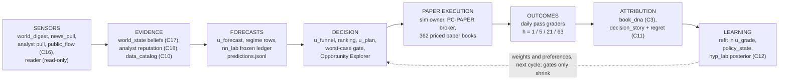

# Aegis V1 Beta (2026-10-07)

Status: the public story of the project as of the morning of 2026-10-07 (HKT). Licence of everything
described here: `PRODUCT_EXPERIMENT` (paper only), unless a line says otherwise. The plan this document
summarises is `ROADMAP_2026-10-06_V1_BETA_THE_LOOP_THAT_LEARNS.md` (TIER 1). The diary behind it is
`HANDOFF_2026-10-07_V1_BETA_NIGHT_ONE.md`. Receipt paths are relative to `backend/data/optimus/` unless
they start with `docs/`.

**RESULT IMPROVEMENT: NONE.** This is the house convention: a document that moves no result says so in
its first paragraph. Nothing on disk beats the market after costs on a declared read, historically or
forward. What exists is a loop that runs, grades itself, freezes the alternatives it did not take, and
reads every result against a control built to be fair.

---

## 1. What Aegis is

Aegis is an open-source investment research system that writes down what it believes before an outcome
exists, grades every belief against what then happens, and lets only graded beliefs change how paper
capital is sized. Language models read the world and propose; deterministic code ranks, sizes, stops and
exits; every book has a matched control twin; every number names the JSON receipt it came from. It trades
paper only. No language model has authority over real capital, and no result in this repository is a
claim that Aegis beats the market. The question the project is built to answer is not "does it win?" but
"when something wins, which input did it, and when did we first know?"

---

## 2. The pipeline

Each box names the live module and the receipt a reader can open. A box is drawn only if a module with a
caller exists; the house rule is that a module without a caller fails the test suite.

| stage | live module | receipt to open | state on 2026-10-07 |
|---|---|---|---|
| Sensors | `world_digest` (news), `news_pull`, analyst pull, `public_flow` sensors (C16), OpenClaw reader (read-only) | `digest/world_digest_20261006T214456Z.json`; `public_flow/receipts/usaspending_20261006T215032Z.json`; `public_flow/receipts/senate_lda_20261006T215232Z.json` | USAspending 2,059 rows added, status OK; Senate LDA 0 rows, REFUSED (host answers 403); news collectors 628 new rows over 29 sources (`health/health_20261006T175305Z.json`, row `news_collectors`) |
| Evidence | `world_state` beliefs + provenance (C17); analyst reputation weights (C18); `data_catalog` (C10) | `digest/world_state_20261006T214456Z.json`; `analyst/reputation_weights_2026-10.json`; `data_catalog/catalog_20261006T180640Z.json` | 16 beliefs, 8 scenarios all `DECLARED_PRIOR`; 4,742 datasets catalogued, 61 replay groups |
| Forecasts | `u_forecast`, regime rows `news_digest:regime_v0`, `nn_lab` frozen forecasts | `predictions.jsonl` (14 regime rows); `nn_lab/receipts/wf_20261007T_c5_review.json` | graders alive; regime rows have 0 graded dates (first h5 grades 2026-10-09) |
| Decision | `u_funnel`, ranking, `u_plan` + decision contract, per-sleeve worst-case gate, Opportunity Explorer (C4) | `../funnel_night10.json` (`generated_at` 2026-10-06T15:51:08Z); `decisions/2026-10-06.json`; `pc_mandate/reconcile_2026-10-06_147824639837.json`; `opportunities/opportunities_2026-10-06_20261006T214339Z.json` | funnel refreshed (25 candidates, 2 eligible); worst case 14.08% of equity vs a 10% limit, so EXPLOIT is capped at 54.38% gross |
| Paper execution | `AegisSimOwner` → sim session → PC-PAPER paper broker | `paper_accounts/pc_snapshot/state_latest.json`; `paper_accounts/roi_2026-10-06T163850Z.json` | sim session RUNNING on 10-06; broker holds 79.85% cash, 20.15% in 10 names |
| Outcomes | daily pass (graders), book grader | `night_factory_2026-10-06/daily_pass_2026-10-06.json` | 12 ok / 2 nothing-to-do / 0 refused; 137 forecast rows due and unresolved at the time of the probe |
| Attribution | `book_dna` (C3); `decision_story` + `regret_ledger` (C11) | `paper_accounts/book_dna_2026-10-06T163850Z.json` | book_dna runs; **no live decision story exists yet** (dry run only) |
| Learning | `refit` in `u_grade`; `policy_state`; hyp_lab family posterior (C12) | `pc_book/policy_state.json`; `hyp_lab/LEDGER.md` | `policy_state` is WRITE-ONLY: no plan in the last two sessions read it (health row `policy_state`, STALE) |

---

## 3. The three licences

Research rigour decides what Aegis may **claim**. It does not decide what Aegis may **test in paper**.

| licence | permits | required before it starts |
|---|---|---|
| `PRODUCT_EXPERIMENT` | internal simulation and external **paper** brokerage | a frozen strategy contract before the first decision: policy hash, timestamp, inputs, costs, fill convention, objective. No significance gate. |
| `CAPITAL_CANDIDATE` | candidacy for real money; promotion stays attended by a human | matured forward evidence, realistic costs, calibration, utility improvement, drawdown and ruin bounds |
| `RESEARCH_CLAIM` | a public skill claim or a paper | full pre-registration, minimum detectable effect, multiplicity control, matched controls, holdout |

Nothing in this repository holds `CAPITAL_CANDIDATE` or `RESEARCH_CLAIM` today. Four things never relax
at any licence and are enforced in code: no information acted on before it was public; no target
leakage; costs are never omitted; a candidate's version is frozen once it enters forward paper.

---

## 4. The evidence ladder

Every number shown to a reader carries one label (roadmap §7; implemented in
`backend/services/book_dna.py`, `LABEL_LADDER`).

| label | what it means | who may award it |
|---|---|---|
| `OBSERVED(n)` | a number measured over n sessions. A fact about the past, not evidence of skill. | any receipt |
| `EARLY_EVIDENCE` | at least 21 sessions, excess over SPY above zero, and at least 2 of 3 sub-windows positive | `book_dna` |
| `REPLICATED` | `EARLY_EVIDENCE` plus a positive excess over the fair twin, or a frozen replication that also qualifies | `book_dna` (its ceiling) |
| `VALIDATED_EDGE` | a validator run once on data the idea never saw | not awarded by any module today |

Side labels used in the receipts: `BACKTEST-ONLY` (historical simulation, never a claim), `ARMED`
(machinery built, nothing accrued), `DISCOVERY_ONLY` (a run allowed to overfit on purpose),
`CANNOT_DISTINGUISH` (the sample cannot separate the result from zero), `FAILED_VARIANT` (one
implementation failed its declared read; the mechanism is not closed), `NOT MEASURED` (no receipt holds
the number).

**Where the estate sits today:** all 362 books in the 2026-10-06 receipt carry `OBSERVED(n)`; none
carries `EARLY_EVIDENCE`. The one book with 26 sessions ahead of SPY (hack2) stays `OBSERVED(26)` because
its daily series covers only 6 of its 26 sessions, so its sub-windows cannot be computed
(`paper_accounts/book_dna_2026-10-06T163850Z.json`, `books[account=hack2].evidence`).

---

## 5. The honest scoreboard (2026-10-07 morning)

**RESULT IMPROVEMENT: NONE.** Updated from the night-one handoff §1 with this morning's chunks C14, C16,
C17 and C18.

| line | value | label | receipt |
|---|---|---|---|
| Historical result on CRSP 1991-2024 | On the sticky twin (cost-fair by construction), 44 of 277 scored rules reach fair-twin t >= 2; 40 of those also pass pure selection; **1** (`qc761_ebit_ev_ebit_ic_large_annual`) also beats the market in validation, with pure-selection t 1.16 in validation and 2009 carrying its market line. 24 rules were refused by name. **Historical alpha on CRSP: not demonstrated.** | `BACKTEST-ONLY` | `hyp_lab/twin_board_SUMMARY_STK_2026-10-07_2.json` (`summary`); `docs/research_notes/2026-10-06/sticky_twin_2026-10-06.md` |
| Paper estate | 362 priced; 147 ahead of SPY over their own window, 160 behind. The 147 are 108 control twins + 3 controls + 36 strategy books, which collapse to about **2.6 ex-ante bets** (4.6 net of SPY). **1 book with >= 21 sessions is ahead of SPY**: hack2, +1.14 pp over 26 sessions. The most common name among strategy winners is MU (17 of 33 books). | `OBSERVED(n)` | `paper_accounts/roi_2026-10-06T163850Z.json` (`aggregate.honest_sentence`); `paper_accounts/book_dna_2026-10-06T163850Z.json` (`summary.top_line`) |
| By family (same receipt) | website lanes −2.74%; Alpaca fleet −9.17% (5 priced); PC-PAPER +0.27%; night books +3.03%, their twins −1.11%; all priced books excluding control twins +1.585% (91 books) | `OBSERVED(n)` | `paper_accounts/roi_2026-10-06T163850Z.json` (`aggregate.by_family`) |
| PC-PAPER ($1M paper mandate) | +0.27% since 2026-09-22 vs SPY +0.86% over the same window (−0.60 pp), holding 79.85% cash. (The morning receipt `roi_2026-10-06T045934Z.json`, which the roadmap §0 quotes, had it +0.19% vs SPY +0.17%, i.e. +0.02 pp; with 80% cash the sign follows SPY, not selection.) | `OBSERVED(n)` | `paper_accounts/roi_2026-10-06T163850Z.json` (`rows[account=PC-PAPER]`); `pc_mandate/reconcile_2026-10-06_147824639837.json` (`positions_reconciliation.broker`) |
| Website lanes since June | all 10 behind SPY over their own windows, from −1.39 pp (tsmom-overlay, +3.71%) to −28.26 pp (mirror, −24.48%) | `OBSERVED(n)` | `paper_accounts/roi_2026-10-06T163850Z.json` (`rows`, family `website_lane`) |
| Live decision loop | ALIVE: a scheduled sim owner starts a session on US trading days; capital is read from broker equity ($1,002,662); funnel refreshed (25 candidates, 2 eligible). Positions are still UNRECONCILED (the contract resolves 99.75% to a benchmark core; the broker holds 79.85% cash). This week the account does almost nothing by design. | `OBSERVED` | `pc_mandate/reconcile_2026-10-06_147824639837.json`; `health/health_20261006T175305Z.json` (`sim_session`, `u_funnel`) |
| nn_lab | running again under the membership freeze; the network does not beat ridge or LightGBM at any horizon; 0 forward forecasts graded so far. No model holds forward weight. | `OBSERVED` | `nn_lab/receipts/wf_20261007T_c5_review.json`; `docs/research_notes/2026-10-06/nn_lab_membership_freeze_2026-10-06.md` |
| Theory cells | hi52, insider buy-and-hold, beat-streak: `FAILED_VARIANT` on their declared primaries, all three unpowered by their own rule | `BACKTEST-ONLY` | `hyp_lab/theory_*_RESULTS_TC_2026-10-06_1.json`; `docs/research_notes/2026-10-06/theory_cells_2026-10-06.md` |
| Public-flow sensors (C16, new) | USAspending: 2,059 transaction rows (10 recipients, 90 days), median 41 days from contract action to our first sight (p10 11, p90 81). Senate LDA: REFUSED (403). Crypto risk sensor: 1 snapshot. A sensor is never a trade signal on its own. | `OBSERVED` | `public_flow/receipts/usaspending_20261006T215032Z.json`; `public_flow/receipts/senate_lda_20261006T215232Z.json`; `public_flow/receipts/crypto_risk_sensor_20261006T215233Z.json` |
| World state + regime rows (C17, new) | 16 beliefs (7 directional), 14 regime forecast rows (7 variables × h1/h5), 8 scenarios, all `DECLARED_PRIOR`. Regime cost $0.0004 per cycle. News-tilt trust 0.0069, not applied. No regime number is a finding before 2026-10-09 and three graded dates. | `ARMED` | `digest/world_state_20261006T214456Z.json`; `digest/regime_grade_2026-10-06_20261006T214456Z.json` |
| Analyst reputation (C18, new) | the Explorer prints `n_effective` beside the raw analyst count; the snowball follow-through shadow series writes rows (23,370); cross-sectional rho 0.0199 (95% CI 0.0108 to 0.0274) over 18,963 events, 21 months. Nothing trades on it. | `OBSERVED` | `analyst/snowball_rho_20261006T214926Z.json`; `analyst/snowball_shadow.jsonl`; `analyst/reputation_weights_2026-10.json` |
| Process leak (C14, new) | the OpenClaw gateway left four OS processes per agent session (146 turns, about 584 processes); `release_session` now deletes the session and a `process_census` health row goes red above declared caps | operational | `docs/research_notes/2026-10-07/gateway_process_leak_2026-10-07.md` |
| LLM spend | DeepSeek balance **$17.87** at 2026-10-06T22:44:42Z. Provider-measured spend from 2026-09-27T06:45Z to then: **$16.03** (no top-up inside that window). | `OBSERVED` | `deepseek_balance.jsonl` (rows `cost_audit`); `python -m scripts.llm_cost_audit --snapshot` |
| Forward reads, dated | digest 5-session grades 2026-10-09; SHADOW_NEWS trust may leave 0 ~10-11; straddle first entry 10-16; LIB-FWD-TWIN-1 early kill 10-26; CRSP_BLEND_v0 / SHADOW_BAYES_v1 at session 21 ~10-27 | — | roadmap §1 |

---

## 6. What we can claim, and what we cannot

**We can claim (each with its receipt):**

1. **A loop that runs.** A scheduled owner starts a paper session on US trading days, the candidate set
   is refreshed inside it, capital is read from the broker, and a worst-case gate priced on the names
   the sleeve would buy caps exposure every cycle (`pc_mandate/reconcile_2026-10-06_147824639837.json`).
2. **A loop that grades itself.** Forecast rows are frozen before their outcome and graded at 1/5/21/63
   sessions by a daily pass that reports refusals instead of hiding them
   (`night_factory_2026-10-06/daily_pass_2026-10-06.json`). Health reads each job's own receipt, so a
   process that is alive but not progressing reads STALE (`health/health_20261006T175305Z.json`).
3. **A loop that freezes its alternatives.** Each decision is written with the alternatives it did not
   take (buy default, half, double, next open, exit now, next-ranked name, leave one source out) before
   the outcome exists, sealed with a hash. Exercised in a dry run: 51 stories, 746 frozen alternatives,
   replay MATCHES (`docs/research_notes/2026-10-06/decision_story_and_regret_2026-10-06.md`). The first
   live story is owed (see §9).
4. **A control that is fair by construction.** The sticky twin shares its rule's turnover and pays the
   same cost model; random controls read t −0.3 to −0.5 on it, where the old monthly twin read them
   near −3 from turnover alone (`hyp_lab/twin_board_SUMMARY_STK_2026-10-07_2.json`;
   `docs/research_notes/2026-10-06/DECLARATION_TWIN_STICKY_v1.json`, sha256 `7333553e…`).

**We cannot claim:**

- **Beating SPY historically.** On CRSP with the fair twin, one rule of 277 beats the market in
  validation, and it fails pure selection there. Historical alpha: not demonstrated.
- **Beating SPY forward.** One book has more than 21 sessions ahead of SPY, and it is still
  `OBSERVED(26)`. The rest of the "ahead" count is twins, controls and about 2.6 independent bets.
- **That any model or source has earned weight.** nn_lab's network has no forward weight; the news tilt
  has trust 0.0069 and is not applied; regime rows have zero graded dates.
- **That the decision story measures regret honestly yet.** Its reviewer found three of six regret types
  biased positive by construction; they were rebuilt as signed differences with a null test, and no
  live row exists to read.

---

## 7. The review loop is a feature

Every chunk is built by one Opus model and then attacked by a second Opus model playing an investor who
says "you are wrong; I would have done this". The orchestrator adjudicates, and the build is fixed before
merge. Reviews live in `docs/reviews/`.

| chunk | review | score | verdict |
|---|---|---:|---|
| C1 fair twin | `REVIEW_2026-10-06_C1_FAIR_TWIN.md` | 58 | MERGE WITH FIXES |
| C2 PC mandate + sim owner | `REVIEW_2026-10-06_C2_PC_MANDATE_AND_SIM_OWNER.md` | 61 | MERGE WITH FIXES |
| C3 book_dna | `REVIEW_2026-10-06_C3_BOOK_DNA.md` | 64 | MERGE WITH FIXES |
| C4 Opportunity Explorer | `REVIEW_2026-10-06_C4_OPPORTUNITY_EXPLORER.md` | 63 | MERGE WITH FIXES |
| C5 nn_lab membership freeze | `REVIEW_2026-10-06_C5_NN_LAB_MEMBERSHIP_FREEZE.md` | 64 | MERGE WITH FIXES |
| C6 Telegram cockpit | `REVIEW_2026-10-06_C6_TELEGRAM_COCKPIT.md` | 70 | MERGE WITH FIXES |
| C7 query planner | `REVIEW_2026-10-06_C7_QUERY_PLANNER.md` | 64 | MERGE WITH FIXES |
| C9 contest direction | `REVIEW_2026-10-06_C9_CONTEST_DIRECTION.md` | 58 | MERGE WITH FIXES |
| C10 data catalog | `REVIEW_2026-10-06_C10_DATA_CATALOG.md` | 64 | ship the archiver and catalog; revert or fix the guard change |
| C11 decision story + regret | `REVIEW_2026-10-06_C11_DECISION_STORY_REGRET.md` | 56 | plumbing sound; measurement not yet honest |
| C12 theory cells | `REVIEW_2026-10-06_C12_THEORY_CELLS.md` | 58 | labels stand; two numbers wrong in size |

Scores run 56 to 70. Not yet reviewed: C8 (progress-aware health) has no review file on disk, and this
morning's C14, C16, C17 and C18 have none yet.

**What the attacks found that the builds had wrong** (handoff §3):

- A twin rebuilt monthly flatters a holding rule even when it pays its own turnover; the control must
  share the rule's turnover by construction. Read a twin verdict only where pure selection agrees.
- Two boards measured turnover in different units (per rebalance vs per month); nobody noticed until a
  reviewer compared one rule across both.
- A worst case priced at the universe median sigma passes; priced on the names the sleeve would buy, it
  refuses. Price risk on the book you would hold.
- A "reconciled" check that compared a number with itself was a tautology; reconcile positions.
- Sizing and timing regret defined as best-of-two is positive on a random walk; every regret must be a
  signed difference that passes a null test.
- A point-in-time check on vendor data is empty when every row carries the newest pull date; store
  first-seen.
- A seal that checks file size is not a seal.
- Counting "independent" books from name overlap overstates independence several-fold; count bets from
  ex-ante return correlation.
- A membership freeze that stores adjusted-close dollar volume locks in a small look-ahead.
- A nightly `--apply` that writes manifests nobody commits is not archival.

---

## 8. Open owner decisions

Only the owner can make these. The machine applies a default and keeps running.

| # | decision | state |
|---|---|---|
| D1 | Bloomberg Global Trading Challenge: did registration complete before 11:59 pm 2026-10-04 New York time (11:59 am 10-05 HKT)? If yes: create `contest/REGISTERED`, export the WLS `MEMB` list, choose the live book (default ROT5_TRAIL) | OPEN; the live desk refuses without both |
| D2 | Six fleet roles and an Alpaca reset (proposal in roadmap §6) | OPEN |
| D5 | EVLV / RZLV tight stops | OPEN |
| D7 | sign-ups and watchlists on news sites | OPEN, not built |
| D13 | Mirror lane: enforce the declared 25% cap by holding the remainder in cash (sacred NAV path) | OPEN, recommended yes |
| D14 | PC-PAPER benchmark core: hold 1 − active in SPY so every sleeve is graded as excess | OPEN |
| D15 | OpenClaw search provider (a paid API conflicts with "no payments") | OPEN; $0 RSS and EDGAR sources run meanwhile |
| D16 | a fourth risk flag (pre-revenue / price-to-sales) so names like QUBT are flagged | OPEN |
| D17 | commit the ~6 MB opportunities receipt daily so the public page works on Railway, or accept a stale page there | OPEN |
| new | register the scheduled owners added this morning (`python -m scripts.task_keeper register-owners --apply`, covers `AegisPublicFlow`) and `AegisDataCatalog` (health: DEGRADED, no scheduled task) | OPEN |
| new | an FEC API key (free web-form sign-up) is the owner's call; the FEC terms restrict commercial use | OPEN (`docs/research_notes/2026-10-07/public_flow_sensors_2026-10-07.md`) |
| new | one OpenClaw config line, `"sessionIdleTtlMs": 600000` under `mcp` | OPEN (`docs/research_notes/2026-10-07/gateway_process_leak_2026-10-07.md`) |

---

## 9. V1 Beta acceptance (roadmap §9), clause by clause

The definition: for one full US session the machine does each of the following. It does not require
beating SPY.

| clause | status | receipt that shows it |
|---|---|---|
| one **full** US session with every clause below on the new code | **NOT YET.** Session `b7b5981048e5` ran on 10-06 with the old `u_plan`; no `pc_book/2026-10-06/intended_book.json` exists (health `u_plan`: UNKNOWN) | `health/health_20261006T175305Z.json` |
| refreshes its candidate set | **MET** (10-06): `generated_at` moved 2026-09-24 → 2026-10-06T15:51:08Z, 25 candidates. The eligible set is still 2 names, and `n_considered` has read 2 for six contracts (health: DEGRADED) | `../funnel_night10.json`; `health/health_20261006T175305Z.json` (`u_funnel`, `decision_contract`) |
| ranks with direction and magnitude shown separately | **PARTIALLY.** Separate columns on the Opportunity Explorer; review C4 F9 notes the magnitude score is one click from sorting a long list; not verified on `u_plan`'s own ranking | `opportunities/opportunities_2026-10-06_20261006T214339Z.json`; `docs/reviews/REVIEW_2026-10-06_C4_OPPORTUNITY_EXPLORER.md` |
| paper decisions sized on the $1M mandate with a $40k view | **PARTIALLY.** Contract capital = broker equity $1,002,662 (capital OK); three agency sleeves are still sized at $40,000 on the IPS basis (SLEEVE_BASIS_DISAGREES) | `pc_mandate/reconcile_2026-10-06_147824639837.json` |
| records every HOLD with its BUY counterfactual | **NOT YET live.** Built and exercised dry (51 stories, 746 alternatives, replay MATCHES); no live story on disk | `docs/research_notes/2026-10-06/decision_story_and_regret_2026-10-06.md` |
| executes and reconciles at the broker | **PARTIALLY.** Executes on paper; capital reconciles; positions UNRECONCILED (contract 99.75% benchmark core, broker 79.85% cash) | `pc_mandate/reconcile_2026-10-06_147824639837.json` (`positions_reconciliation`) |
| grades at 1/5/21 sessions | **PARTIALLY.** Met for forecast rows (daily pass 12 ok / 0 refused); decision stories have nothing to grade yet | `night_factory_2026-10-06/daily_pass_2026-10-06.json` |
| prints regret by type and marginal contribution with its sample size | **PARTIALLY.** Wired into the daily pass with `n_sessions` and `TRUST_AT_63`; zero graded rows | `docs/research_notes/2026-10-06/decision_story_and_regret_2026-10-06.md` |
| labels every book's standing honestly on one web page | **PARTIALLY.** Every book carries a label in `book_dna` and in `docs/PAPER_ACCOUNTS.md`; the web page (`/arena`, chunk C19) is not in `frontend/src/app` at the time of writing | `paper_accounts/book_dna_2026-10-06T163850Z.json`; `docs/PAPER_ACCOUNTS.md` |
| no subsystem alive but not progressing | **NOT YET.** Health at 2026-10-06T17:53Z: 0 DEAD, 8 STALE, 3 DEGRADED, 4 UNKNOWN (incl. `u_plan`, `learn_rota`); `policy_state` written but read by no plan; the gateway process leak was found by hand before `process_census` existed | `health/health_20261006T175305Z.json`; `docs/research_notes/2026-10-07/gateway_process_leak_2026-10-07.md` |
| when something beats SPY, show which input did it and when we first knew | **PARTIALLY.** Lineage ids and six latency stamps on every story; leave-one-source-out rows frozen; price momentum is still NOT_SEPARABLE in the dry replay | `docs/research_notes/2026-10-06/decision_story_and_regret_2026-10-06.md` |

Tally: 1 clause met, 7 partially, 3 not yet. V1 Beta is **not reached**. The shortest path is the first
full US session on the merged code (the next sim session after the suite is green-gated and merged),
followed by its first five-session grade.

---

## 10. Where to look next

- The plan: `docs/ROADMAP_2026-10-06_V1_BETA_THE_LOOP_THAT_LEARNS.md`.
- The funding evidence pack: `docs/FUNDING_EVIDENCE_PACK_2026-10-07.md`.
- What did not work: `NEGATIVE_RESULTS.md`.
- Every paper book with its label: `docs/PAPER_ACCOUNTS.md`.
- Web pages live in the app: `/opportunities` (Opportunity Explorer), `/brain`. In flight (chunk C19,
  not yet in the app at the time of writing): `/arena`, `/forecast-lab`, `/theory-lab`, `/health`.
