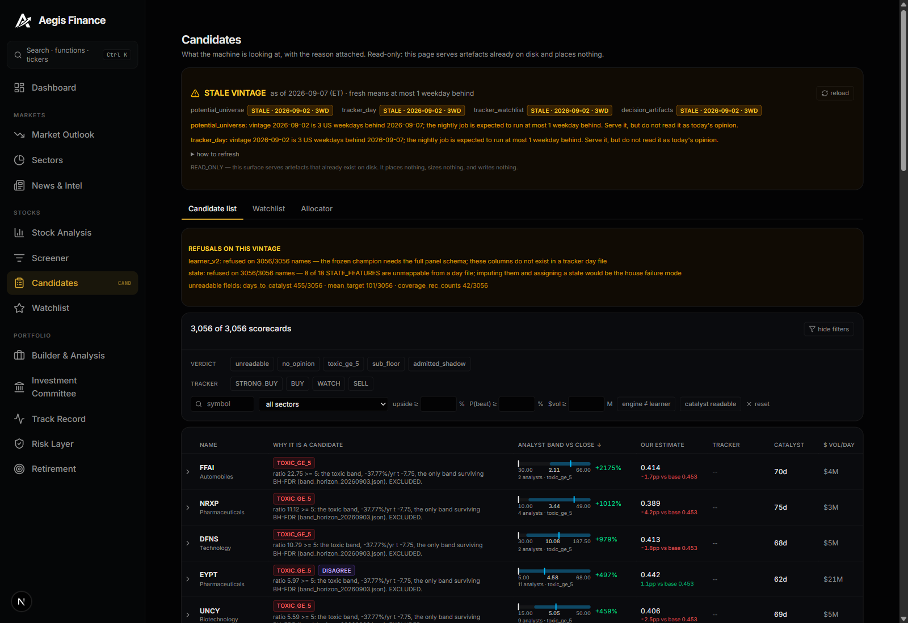
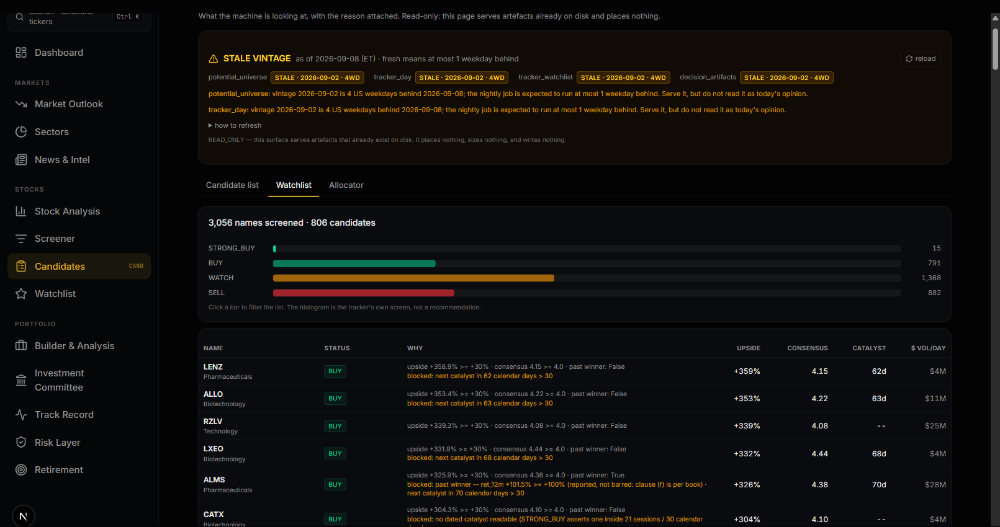

# BUILD 2026-09-07b — H1: THE CANDIDATE SURFACE (read-only API + page)

**Lane:** `ROADMAP_2026-09-07_TWO_MODES_AMENDMENT.md` §2 **H1**.
**Licence:** `PRODUCT_EXPERIMENT`. **Authority:** READ_ONLY — nothing here writes,
orders, sizes or seals. **LLM spend: $0.00** (no API call was made).
**Started 2026-09-07 ET, finished 2026-09-08 ET.**

## RESULTS SCOREBOARD

| line | value |
|---|---|
| **RESULT IMPROVEMENT** | **NONE** — this is a surface, not a strategy. No book changed, no weight moved, no receipt was written. |
| product gap closed | the 3,056 potential-universe scorecards, the 3,056-name tracker watchlist + status histogram, the analyst band vs our own estimate, and the allocator's decision artefacts now have a web surface. Grounding A.5 items 1, 2, 5 and (partly) 6 move from **NONE** to **LIVE**. |
| new actionable finding | **the nightly potential-universe job has been silently degraded since 2026-09-05.** Re-run today it refuses `learner_v1` on **3,056 of 3,056** names (schema-hash mismatch after commit `3bf7a34`), where the 2026-09-02 vintage on disk scored 2,947. Details in §3. |
| second finding | a local `npm run dev` talks to **Railway prod**, not the local backend — `frontend/.env.local` pins `NEXT_PUBLIC_API_URL` to `https://aegis-finance-production.up.railway.app`. §7. |
| vintage today | **STALE at 2026-09-02, 4 US weekdays behind 2026-09-08** — all four sources. It is not fresh, and the page says so in a banner rather than in a footnote. |
| tests | **+53 new, all passing.** Suite totals moved under me (five agents on one tree): baseline 7,137 passed / 2 failed → final **7,364 passed / 7 failed**. None of the 7 is mine — one baseline failure was fixed by another lane, six new ones are the provider lane's live-network-in-a-unit-test. §6 |
| `npx next build` | ✓ compiled, TypeScript clean, `/candidates` prerendered. §5 |

---

## 1. THE ENDPOINTS

All under `/api/candidates`, all **GET**, all served from local files. No network
call, no Railway, no broker, no database. Registered in `backend/main.py`
beside `arena.router`. Source: `backend/routers/candidates.py`.

Every response carries, at the top level:

```
version   "candidate_surface_v1/2026-09-07"
licence   "PRODUCT_EXPERIMENT"
authority "READ_ONLY — this surface serves artefacts that already exist on disk.
           It places nothing, sizes nothing, and writes nothing."
vintage   {…}      ← §2
stale     bool
```

### `GET /api/candidates/vintages`

The endpoint to read first: what exists, how old it is, and how to refresh it.
No parameters.

```jsonc
{
  "as_of_utc": "...", "as_of_et": "2026-09-08",
  "worst_freshness": "STALE",           // FRESH | STALE | CANNOT_DETERMINE
  "any_stale": true,
  "sources": {
    "potential_universe": { …vintage…, "n_scorecards": 3056,
                            "counts": {...}, "whole_universe_refusals": {...},
                            "field_readability": {...}, "available_days": [...] },
    "tracker_day":        { …vintage…, "status_overlay": {...} },
    "tracker_watchlist":  { …vintage…, "status_histogram": {...},
                            "n_symbols": 3056, "n_candidates": 806 },
    "decision_artifacts": { …vintage…, "personalities": ["aggressive","balanced"] }
  },
  "how_to_refresh": {
    "potential_universe": "python -m scripts.potential_universe_run",
    "decision_artifacts": "python -m scripts.allocator_run",
    "tracker": "python -m scripts.tracker --refresh   (EXECUTION repo; …)"
  }
}
```

### `GET /api/candidates/universe`

The candidate list. One row per observable company-vintage.

| param | type | notes |
|---|---|---|
| `day` | `YYYY-MM-DD` | default = newest vintage. Malformed → **422**, absent → **404** |
| `verdict` | csv | `unreadable, no_opinion, toxic_ge_5, sub_floor, admitted_shadow`; unknown → **422** |
| `tier` | csv | `CANNOT_DETERMINE, NONE, OBSERVE_ONLY, FULL` |
| `status` | csv | tracker status `STRONG_BUY, BUY, WATCH, SELL` |
| `sector`, `q` | str | sector exact; `q` = case-insensitive symbol prefix |
| `min_upside`, `max_upside` | float | decimal, `ge=-1.0` |
| `min_p_beat` | float | `0..1` |
| `min_dollar_volume` | float | USD/day |
| `max_days_to_catalyst` | float | |
| `disagreement_only`, `catalyst_readable_only` | bool | |
| `sort` | enum | 15 keys (`symbol upside ratio upside_low coverage p_beat vs_base_rate learner_score engine_prior_1m rank_gap days_to_catalyst dollar_volume market_cap ret_12m drawdown_60d`). Closed set — unknown → **422**, never a silent fallback |
| `dir` | `asc\|desc` | pattern-validated |
| `limit`, `offset` | int | 1..500 (`config.CANDIDATE_PAGE_MAX_LIMIT`), over → **422** |

Response envelope:

```jsonc
{
  "vintage": {...}, "tracker_vintage": {...}, "stale": true,
  "n_scorecards": 3056, "n_matched": 3056, "n_returned": 50,
  "offset": 0, "limit": 50,
  "sort": {"key":"upside","dir":"desc","missing_values":"sorted last in both directions"},
  "filters": { …echoed back verbatim… },       // a screenshot is reproducible
  "facets": {"verdicts":[…],"tiers":[…],"statuses":[…],"sorts":[…],"sectors":[…]},
  "counts": {…header counts…},
  "whole_universe_refusals": {…}, "field_readability": {…}, "conventions": {…},
  "rows": [CandidateRow]
}
```

`CandidateRow` (abridged; the full shape is typed in `frontend/src/lib/api.ts`):

```jsonc
{
  "symbol": "NB", "day": "2026-09-02", "sector": "…", "exchange": "…",
  "tradable": true, "shortable": true,

  "reason": {                                   // WHY it is a candidate
    "verdict": "admitted_shadow", "band": "b_3_5",
    "headline": "ratio 3.10 …",
    "engine_reasons": [...],
    "tracker_status": "STRONG_BUY",
    "tracker_reasons": ["upside +210.0% >= +50%", "consensus 4.23 >= 4.1", …],
    "tracker_blocked_by": [...]
  },

  "band": {                                     // the STREET's opinion
    "status": "OK", "close": 4.0,
    "target_low": 10.0, "target_mean": 12.4, "target_high": 15.0,
    "ratio": 3.1, "upside": 2.1, "upside_low": 1.5, "upside_high": 2.75,
    "band_label": "b_3_5", "n_analysts": 2, "coverage": 5,
    "consensus": 4.231, "target_source": "yfinance:analyst_price_targets"
  },

  "our_estimate": {                             // OUR opinion, refusals intact
    "engine_prior_1m": -0.0388,
    "learner_v1": {"status":"OK","score":0.4294,
                   "unit":"P(excess > 0) over the horizon -- a probability, NOT a return",
                   "reasons":[], "missing_inputs":[]},
    "p_beat": {"status":"OK","raw":0.4294,"debiased":0.4071,
               "base_rate":0.4532,"vs_base_rate":-0.0239},
    "learner_v2": {"status":"REFUSED","reason":"day file cannot supply 23 …"},
    "state": {"status":"CANNOT_DETERMINE","reason":"8 of 18 state features unmappable"}
  },

  "disagreement": {"verdict":"AGREE","sign_disagreement":false,"rank_gap":-0.49},
  "execution": {"tier":"FULL","observe_only":false,"max_usd":…,
                "median_dollar_volume":…,"reason":"$… clears the execute floor"},
  "days_to_catalyst": {"readable": true, "value": 7.0, "units":"calendar_days"},
  "market_cap_usd": …, "ret_12m": …, "drawdown_60d": …, "past_winner": false,
  "pit": {"status":"OK"},
  "falsifiers": [{"field":"ratio","op":">=","value":5,"then":"enters the toxic band…"}]
}
```

### `GET /api/candidates/universe/{symbol}`

One name. `?day=` optional. Returns `row` (as above) plus the **raw** `scorecard`
and `tracker_row` and the vintage's `conventions`.
Malformed symbol → **422** (`$$$`), unknown symbol → **404**, case-insensitive.

### `GET /api/candidates/watchlist`

The tracker watchlist and its status histogram, from `state/tracker/latest.json`.
Params: `status` (csv), `sector`, `q`, `limit`, `offset`.

```jsonc
{
  "vintage": {...}, "stale": true,
  "status_histogram": {"STRONG_BUY":15,"BUY":791,"SELL":882,"WATCH":1368},
  "n_symbols": 3056, "n_candidates": 806, "n_matched": 806,
  "summary": {…the tracker's own summary block, verbatim…},
  "facets": {"statuses":[…],"sectors":[…]},
  "rows": [ …tracker candidate rows with status_reasons / status_blocked_by… ]
}
```

An unreachable execution repo returns **200** with `vintage.status`
`NOT_REACHABLE` and `rows: []` — see §2.

### `GET /api/candidates/bands`

The analyst-target band beside our own estimate, one row per name, sorted by any
of the 15 sort keys. Params: `day`, `band`, `min_coverage`, `sort`, `dir`,
`limit`, `offset`. Carries the vintage's own caveat verbatim:

```
"band_status": "S36: the band is an EXCLUSION rule; only toxic_ge_5 survives FDR;
                admission is shadow/control (band_horizon_20260903.json)"
```

A page that ranks by street upside without that sentence beside it is selling a
factor that was measured not to exist.

### `GET /api/candidates/allocator`

The allocator's decision artefacts, served **verbatim**. Params: `day`,
`personality` (unknown → **404**). The artefact's own
`authority: "SHADOW_ONLY — this artifact places nothing and nothing reads it for
execution"` is repeated, not paraphrased.

### Configuration (all in `backend/config.py`, none hardcoded in the router)

`CANDIDATE_SURFACE_VERSION` · `CANDIDATE_POTENTIAL_UNIVERSE_DIR` ·
`CANDIDATE_DECISION_ARTIFACT_DIR` · `TERMINAL_STATE_DIR` (env
`AEGIS_TERMINAL_STATE_DIR`) · `CANDIDATE_TRACKER_DIR` ·
`CANDIDATE_VINTAGE_FRESH_MAX_AGE_WEEKDAYS = 1` ·
`CANDIDATE_PAGE_DEFAULT_LIMIT = 100` · `CANDIDATE_PAGE_MAX_LIMIT = 500` ·
`CANDIDATE_CACHE_MAX_ENTRIES = 8`.

The 6.4 MB vintage is parsed at most once per `(mtime, size)` into an in-memory
dict — no database, consistent with CLAUDE.md.

---

## 2. VINTAGE AND **STALE** — AND THE TESTS THAT PROVE IT

### The block

```jsonc
{
  "artefact": "potential_universe",
  "status": "OK",                       // OK | ABSENT | NOT_REACHABLE | UNREADABLE
  "day": "2026-09-02",
  "dated_by": "artefact_self_stamp",    // or "filename_stem" — NEVER the filesystem
  "generated_at_utc": "2026-09-03T16:03:27+00:00",
  "source": "…/potential_universe/2026-09-02.jsonl",
  "as_of_et": "2026-09-08", "as_of_utc": "…",
  "age_calendar_days": 6, "age_weekdays": 4,
  "freshness": "STALE",                 // FRESH | STALE | CANNOT_DETERMINE
  "stale": true,
  "stale_reason": "vintage 2026-09-02 is 4 US weekdays behind 2026-09-08; the
                   nightly job is expected to run at most 1 weekday behind.
                   Serve it, but do not read it as today's opinion.",
  "fresh_max_age_weekdays": 1
}
```

Three rules, each paid for elsewhere in this programme:

1. **Dated by its own stamp, never by the filesystem.** CLAUDE.md §7 (an
   mtime-dated gate kept CI red for two days). `dated_by` is the audit trail and
   can only ever be `artefact_self_stamp` or `filename_stem`.
2. **Age in US weekdays on the US/Eastern clock.** A calendar-day rule paints
   every Monday red, and a gate that cannot go green teaches the reader to skim
   red lines. The dev machine runs UTC+8; the tape does not. No holiday calendar
   is consulted, so the session after a market holiday over-warns by one day —
   the safe side of that error, and it is written down in the code.
3. **An unreachable source refuses.** `NOT_REACHABLE` + `CANNOT_DETERMINE`, never
   an empty list. The reason string ends "**This is NOT an empty watchlist.**"

### The decisive test

`backend/tests/test_candidates_router.py::TestVintage::test_mtime_is_never_the_date_source`

It writes a vintage whose **header says it is six weekdays old**, asserts the
file's mtime is within 120 s of now (so the fixture cannot silently stop testing
anything), and then asserts the response reads `dated_by == artefact_self_stamp`,
`freshness == "STALE"`, `stale is True`, and that the stale reason names the day.
A surface that dated by mtime would call that file fresh and prove nothing.

Backed by six more:

| test | proves |
|---|---|
| `test_st_mtime_appears_only_in_the_cache_key` | AST scan: the filesystem clock is readable in exactly one function (`_cached`, for invalidation) and nowhere else. mtime is legitimate for a cache key and illegitimate for a date; the test pins **where**, not merely **whether**. |
| `test_a_recent_vintage_is_fresh` | the gate can go green — a vintage from the previous weekday reads FRESH with `stale_reason: null` |
| `test_filename_stem_is_the_fallback_stamp` | a header with an unparseable `day` falls back to the filename, and says so in `dated_by` |
| `test_dated_by_is_a_closed_set` | over the live `/vintages` response, every source's `dated_by ∈ {null, artefact_self_stamp, filename_stem}` |
| `test_absent_source_cannot_determine` | an absent directory gives `ABSENT` / `CANNOT_DETERMINE` / `stale: null` and names the command that would fix it |
| `test_every_endpoint_carries_a_vintage` | all five endpoints carry a `vintage` with the eight required keys plus a top-level `stale` |

Dates in the fixtures are **derived from `today`** via `_prev_weekday()`, never
literal (CLAUDE.md §5).

### The tracker overlay, and why it is gated

A tracker **day file** carries raw fields only — no `status`, no `upside`, no
`consensus`, no `past_winner`. Those are computed once into `latest.json`'s
candidate list (806 of 3,056 names). The router overlays them onto the day rows
**only when `latest.json` is the same day**, and reports what it did:

```jsonc
"status_overlay": {"applied": true, "n_rows_overlaid": 806,
                   "overlay_day": "2026-09-02", "reason": null}
```

When the days differ the columns are **left empty with a named reason** rather
than filled from a different day. Pasting one day's BUY/SELL beside another
day's targets is exactly the quiet mismatch this surface exists to expose.

---

## 3. THE NIGHTLY JOB — WHAT IT PRODUCED, AND WHY THERE IS NO 2026-09-08 VINTAGE

**Command:** `AEGIS_IGNORE_DOTENV=1 python -m scripts.potential_universe_run --print-only`
**Runtime:** **8.2 s** (2026-09-07) and **8.7 s** (re-run 2026-09-08). Offline, $0.

**It could not produce today's vintage, and running it for real would have made
the on-disk one worse.** Two independent causes, both outside this lane:

### Cause 1 — the upstream tracker has not run since 2026-09-02 (blocking)

`learner/potential_universe.py` builds a vintage **from a tracker day file**. The
newest one on disk is `aegis-alpha-terminal/state/tracker/2026-09-02.jsonl`
(mtime Sep 2 15:04); `latest.json` says `day: 2026-09-02`. The job therefore
resolves "latest tracker day" to 2026-09-02 and can only ever re-emit that day.

> **The candidate list cannot be fresher than the tracker.** The refresh is
> `python -m scripts.tracker --refresh` in the **execution** repo — a network job
> over ~3,056 names, not this lane and not runnable offline. That command is
> printed on the page under "how to refresh".

### Cause 2 — the learner leg is broken, so a re-run would DELETE 2,947 scores

Running the job today prints:

```
POTENTIAL UNIVERSE 2026-09-02  [OK]  potential_universe_v1/2026-09-03
  scorecards: 3056 / rows 3056   pit_refused: 0
  engine verdicts: unreadable=109  no_opinion=2  toxic_ge_5=7  sub_floor=2355  admitted_shadow=583
  capacity tiers:  CANNOT_DETERMINE=0  NONE=0  OBSERVE_ONLY=0  FULL=3056
  learner v1: scored=0 refused=3056
    refusal x3056: whole-universe: schema hash mismatch: sealed against
                   fd48dbc7c7535262, current shadow schema is 7f01…
  learner v2: REFUSED on 3056/3056 (23 missing columns)
  state:      CANNOT_DETERMINE on 3056/3056 (8 missing features)
  sign disagreements (engine vs learner): 0
  field readability: days_to_catalyst 2601/455 · mean_target 2955/101 ·
                     coverage_rec_counts 3014/42 · median_dollar_volume 3056/0
```

The vintage **on disk** (generated 2026-09-03) has `v1_scored: 2947,
v1_refused: 109` and 637 sign disagreements. The difference:

```
learner/dataset.py::schema_hash(shadow_only=True)
    when champion_shadow.joblib was sealed :  fd48dbc7c7535262
    today                                  :  7f01cbe49f85286d
```

`learner/dataset.py` changed in commit **`3bf7a34` (2026-09-05, "Fix the share
basis on the revision legs, an unreachable state, and a sign-blind shape
label")** — two days after the last vintage was written. The frozen shadow model
is now sealed against a schema that no longer exists, and
`learner/potential_universe.py:508` correctly refuses rather than scoring on a
mismatched schema. Nobody saw it because the job has not been run since.

**Decision: I did NOT overwrite the vintage.** Writing today's run would have
replaced 2,947 learner scores and the whole `p_beat` column with 3,056 refusals —
a strictly worse artefact, and the one the new page depends on. The evidence is
the `--print-only` output quoted above, which writes nothing.

**What unblocks it (not this lane):** retrain `champion_shadow.joblib` against
schema `7f01cbe49f85286d` (`learner/shadow.py`), then refresh the tracker, then
run the potential-universe job. Suggested X-block row: *a frozen model whose
schema hash no longer matches the panel must fail a test, not a nightly job's
stdout.*

### So: does the surface show Murat something current?

**No — and that is the first thing it tells him.** All four sources are STALE at
2026-09-02, four US weekdays behind 2026-09-08, and the page opens with an amber
banner naming the day, the lag in weekdays, the reason and the exact refresh
command. Before today the same five-day-old file was the only candidate list
anyone could have consulted, and nothing anywhere said it was old.

**The page renders the refusals as loudly as the numbers** — a "REFUSALS ON THIS
VINTAGE" card sits above the list showing `learner_v2: refused on 3056/3056`,
`state: refused on 3056/3056`, and the unreadable-field counts
(`days_to_catalyst 455/3056 · mean_target 101/3056 · coverage_rec_counts 42/3056`).
That card is the starved-seal sensor with a screen attached.

---

## 4. THE PAGE

**Route:** `/candidates` · `frontend/src/app/candidates/page.tsx` ·
nav entry "Candidates" under **Stocks**, between Screener and Watchlist.
Deliberately **not** `advancedOnly`: a page the default nav hides is a page that
reads as "never built" to the one person it is for.

**Structure — three tabs on one page, one vintage strip above all of them.**

1. **Vintage strip** (always first). Amber `STALE VINTAGE` banner, the ET as-of
   date, one freshness pill per source (`STALE · 2026-09-02 · 4WD`), the two
   longest stale reasons in full, a collapsible "how to refresh" with the exact
   commands, and the READ_ONLY authority line.
2. **Refusals card** — whole-universe refusals and unreadable-field counts.
3. **Candidate list** — filter rail (verdict chips · tracker-status chips ·
   sector select · symbol prefix search · `upside ≥` · `P(beat) ≥` · `$vol ≥` ·
   *engine ≠ learner* · *catalyst readable* · reset) over a dense sortable table:

   | Name | Why it is a candidate | Analyst band vs close | Our estimate | Tracker | Catalyst | $ Vol/day |
   |---|---|---|---|---|---|---|

   *Why* = a colour-coded verdict pill (`toxic_ge_5` red, `admitted_shadow`
   emerald, `sub_floor` muted) plus the engine's own reason string, plus a
   `disagree` pill when engine and learner disagree in sign.
   *Analyst band* is drawn: a low—high bar with the mean target and today's
   close both marked, and the upside percentage beside it — because a mean
   target alone hides a band that starts below the close.
   *Our estimate* prints the debiased `p_beat` **and** its distance from the
   realised base rate, coloured by sign; the reference is 0.4532, never 0.5.
   Column headers sort server-side; **missing values sort last in both
   directions**, so a name with no analyst target can never top a
   "highest upside" list. Row click expands an inline detail panel: all engine
   reasons, tracker reasons and blockers, the learner refusal text, the
   falsifiers (`if ratio >= 5 → enters the toxic band`), and a link to
   `/stock/{ticker}`. Paged 50 at a time. The band caveat sits under the table.
4. **Watchlist tab** — the status histogram as four clickable bars
   (STRONG_BUY 15 · BUY 791 · WATCH 1,368 · SELL 882) over "3,056 names screened
   · 806 candidates", then the candidate table with each name's `status_reasons`
   and, in amber, its `status_blocked_by`.
5. **Allocator tab** — personality chips (`balanced`, `aggressive`), the
   artefact's SHADOW_ONLY line, and the sleeve table (sleeve · gate · weight ·
   binding constraint).

**Screenshots** (1600×1100, dark theme, real 2026-09-02 vintage, local stack, no
cloud):





**No Railway, no cloud dependency.** The router reads four local paths and makes
no outbound request. `docker compose up` serves it as-is: the compose file
already sets `NEXT_PUBLIC_API_URL=http://localhost:${PORT:-8000}` at build time
and mounts nothing external. The one caveat is §7.3 below.

---

## 5. `npx next build`

```
✓ Compiled successfully in 6.2s
  Running TypeScript ...
  Finished TypeScript in 7.1s ...
✓ Generating static pages using 19 workers (31/31) in 472ms
…
├ ○ /candidates
```

Clean: no type errors, no lint failure, `/candidates` prerendered as static
content alongside the other 30 routes.

---

## 6. TESTS — BASELINE vs FINAL

Command: `AEGIS_IGNORE_DOTENV=1 python -m pytest backend/tests/ -m "not slow" -q --timeout=300`

| | passed | failed | skipped | deselected | wall |
|---|---|---|---|---|---|
| **baseline** (before any edit of mine) | **7,137** | 2 | 20 | 123 | 710.9 s |
| **final** | **7,364** | 7 | 20 | 124 | 761.6 s |

**My contribution is +53 tests, all in
`backend/tests/test_candidates_router.py`, and all 53 pass** — standalone
(`53 passed in 4.37s`) and inside the full run (no `test_candidates_router`
line appears in the failure list).

**The rest of the delta is not mine.** Five other agents were editing this same
tree throughout, so the totals moved underneath the measurement: +227 tests
appeared between the two runs, one baseline failure was fixed by someone else,
and six new ones appeared in a module I never touch. Both counts are reported as
measured rather than adjusted to look tidy.

| failure | at baseline | at final | whose |
|---|---|---|---|
| `test_signal_reachability::test_every_orphan_is_classified` | FAIL (orphans `backend.services.free_inference`, `backend.strategy.{adapters,chain,contract,multipletesting,run,verdict}`) | **PASS** — fixed by the S-block / LLM lanes while I worked | not mine |
| `test_guard_missing_input_contract::test_every_guard_is_enrolled` | FAIL (`sec_insider_bulk` not enrolled) | FAIL, unchanged | the I1 SEC-insider lane |
| `test_arena_brain.py` × 6 | passing | **FAIL** | the LLM-provider lane |

The six `test_arena_brain` failures are `backend/services/arena/beliefs.py`
reaching a **live network connect** inside a non-slow test —
`BLOCKED live network connect to ('3.173.21.63', 443)`, caught by
`conftest.py`'s offline guard. `beliefs.py` calls into
`backend/services/llm_research.py` and `backend/services/model_provider.py`,
both of which are uncommitted-modified in the working tree
(`+107 / -20` lines) by the provider-layer agent. That lane owns them; flagged
here so nobody attributes them to H1.

`backend.routers.candidates` is not an orphan and needs no reachability
classification: routers are seeds in `signal_reachability.reachable_set()`.

### The read-only proof

`backend/tests/test_candidates_router.py::TestReadOnly` — four mechanisms, so
that "read-only" is a property and not a docstring:

1. `test_every_route_is_a_read` — walks `candidates.router.routes` and asserts
   every route's methods ⊆ `{GET, HEAD, OPTIONS}`. It also asserts the router has
   ≥ 5 routes, so it cannot pass by having no routes left.
2. `test_write_verbs_are_405` — 24 live requests (POST/PUT/PATCH/DELETE × the six
   paths); every one must be **405**.
3. `test_source_has_no_write_or_order_verbs` — AST scan of the router source for
   calls to `write / write_text / write_bytes / writelines / mkdir / unlink /
   rmdir / touch / rmtree / chmod / truncate / executemany / submit_order / seal
   / append_row`, for `exec / eval / compile / __import__ / system / popen /
   TradingClient / OrderRequest`, and for any `open()` whose mode is not read.
   Docstrings and comments are exempt (the module cites the allocator and the
   runner script by name); a **call** is not.
4. `test_source_imports_nothing_that_can_place_an_order` — the import list may
   not begin with `alpaca, aegis-alpha-terminal, alpha.brains, alpha.universe,
   backend.db, sqlite3, requests, httpx, urllib, subprocess, shutil, os, learner,
   scripts`. Banning `os` and `shutil` is what makes (3) complete: with neither
   module imported there is no `os.replace`, no `shutil.move` and no shell-exec
   path left for the attribute scan to miss.

Plus `test_authority_string_is_verbatim`, pinning the stamp that travels onto
every response — the same way `learner/allocator.py` pins SHADOW_ONLY.

Full class list (`--collect-only` counts): `TestReadOnly` **28** · `TestVintage`
**8** · `TestUnreachableSource` **2** · `TestQuerySurface` **10** ·
`TestAgainstTheRealVintage` **5** (skipped where no vintage is on the checkout —
CI has none, so the suite stays green there). Total **53**.

---

## 7. WHAT DID NOT WORK, AND WHAT IS STILL OPEN

1. **No fresh vintage exists and I could not make one.** §3. Two named causes,
   both outside this lane. The surface's honest state today is STALE at
   2026-09-02, four weekdays behind. Reported rather than papered over.
2. **The nightly job is silently degraded** (learner refused on 3,056/3,056 after
   `3bf7a34`). Found only because H1 re-ran the job. Suggested X-block row: a
   frozen model whose schema hash no longer matches the panel should fail a
   **test**, not a nightly job's stdout.
3. **`frontend/.env.local` points a local `npm run dev` at Railway prod**
   (`NEXT_PUBLIC_API_URL=https://aegis-finance-production.up.railway.app`). The
   first screenshot attempt rendered `API error: 404 — Not Found` because the
   page was asking **prod** for `/api/candidates`. `docker compose up` is
   unaffected (compose sets the var explicitly). I did **not** edit `.env.local`
   — I passed the variable to the dev-server process instead. Anyone running
   `npm run dev` against a local backend must do the same, or `/candidates` will
   404 until the router deploys.
4. **`uvicorn --host 127.0.0.1` is not enough on Windows.** Chrome resolves
   `localhost` to `::1` first, so the browser's fetches never reached an
   IPv4-only bind and every panel sat on a loading skeleton with no error.
   `--host 0.0.0.0` fixed it.
5. **The Allocator tab has no screenshot.** Two scripted clicks on its tab button
   landed on other elements and navigated away (`/investment-committee`, then
   `/`). The endpoint is verified by test and by curl (`personalities:
   ["aggressive","balanced"]`, `authority: "SHADOW_ONLY …"`), and the tab is a
   table over that response — but it is not photographed, and I am saying so
   rather than implying it was.
6. **`OBSERVE_ONLY` is empty by construction.** The tier filter exists and works,
   but the 2026-09-02 vintage is `{CANNOT_DETERMINE 0, NONE 0, OBSERVE_ONLY 0,
   FULL 3056}` because the tracker screen applies the $3m floor upstream. The
   filter will start returning rows when N3's size-aware floors are populated;
   until then that chip is honestly empty, not broken.
7. **The band's low/high legs need the execution repo.** They come from the
   tracker day file, which a deployed container cannot see. The router degrades
   correctly (`band.status: NOT_REACHABLE`, the vintage's own `ratio`/`upside`
   still served, a `note` naming which legs are missing), and
   `test_universe_still_serves_without_the_execution_repo` pins that. The real
   fix is **H5**, the terminal-state reader.
8. **Not built** (out of H1 scope): per-name history across vintages, a dedicated
   Bands tab on the page (the `/bands` endpoint exists and is tested; the band is
   already drawn per-row in the main list), and any journal/write path — H2's
   job, and deliberately a different router with a different licence.

## FILES

| file | change |
|---|---|
| `backend/routers/candidates.py` | **new** — six GET endpoints, five loaders, the vintage logic |
| `backend/tests/test_candidates_router.py` | **new** — 53 tests |
| `backend/config.py` | +9 constants, appended in one block |
| `backend/main.py` | import + `include_router(candidates.router)` |
| `frontend/src/app/candidates/page.tsx` | **new** — the page |
| `frontend/src/lib/api.ts` | +types and four fetchers, appended |
| `frontend/src/components/sidebar.tsx` | +1 nav item |
| `docs/img/BUILD_2026-09-07b_H1_*.png` | **new** — two screenshots |

Nothing else was touched. No git state was changed; the lead session owns commits.
