# FUNDING EVIDENCE PACK — DRAFT (2026-10-07)

**Status: DRAFT, research input for chunk C23.** Written by a Sonnet researcher from receipts
only; an Opus builder renders the final filing document and the public README update from this.
Every number below names its receipt and carries an evidence label
(`OBSERVED(n)` / `EARLY_EVIDENCE` / `BACKTEST-ONLY` / `NOT MEASURED`). **The word "proven" does
not appear in this document, and "alpha" appears only as "not demonstrated."** Where a number the
brief asked for has no receipt, this document says `NOT MEASURED` rather than estimate it.

Sources read in full for this draft: `README.md`, `docs/AEGIS_STRATEGY_2026-09-26_ONE_PIPELINE.md`,
`docs/ROADMAP_2026-10-06_V1_BETA_THE_LOOP_THAT_LEARNS.md` (§0, §2, §7, §9),
`docs/HANDOFF_2026-10-07_V1_BETA_NIGHT_ONE.md` (§1, §3),
`docs/research_notes/2026-10-06/funding_and_contest_status_2026-10-06.md`,
`docs/research_notes/2026-10-06/decision_story_and_regret_2026-10-06.md`,
`docs/research_notes/2026-10-06/book_dna_build_2026-10-06.md`, and the owner's March 2026 CUPP
deck (`C:\Users\mrthn\Downloads\Aegis Finance - CUPP 2026.pdf`, dated 22/2/2026). The March deck's
"crash prediction" positioning and its competitor table's "Crash Prediction ✓" claim for Aegis are
**not reused** — the funding note already flagged that this is contradicted by the project's own
later negative result (the timing signal lost to buy-and-hold; `NEGATIVE_RESULTS.md §1`), and the
README's "story so far" paragraph confirms the project pivoted specifically because recognizing
risk and predicting returns turned out to be different problems.

---

## 1. One-page problem and product

**Positioning (adopted from the 2026-10-06 handoff's option B, not the March deck's framing):**

> Aegis is **auditable AI investment intelligence**: a system that can prove which information
> changed a decision, records the alternatives it rejected, grades itself against what actually
> happened, and learns only from graded outcomes.

This is deliberately not "an AI that predicts crashes" (the March 2026 pitch) and not "autonomous
returns." The problem it targets is not "can software pick stocks" — many products claim that and
none of the ~21 competitors surveyed publishes independently auditable, cost-inclusive forward
evidence against a benchmark (`docs/AEGIS_STRATEGY_2026-09-26_ONE_PIPELINE.md` §8). The problem
Aegis targets is: **every AI-investing product on the market asks you to trust a black box; none
of the ones surveyed writes down what it believed *before* the outcome, freezes that belief, and
grades it later.** Aegis does that by construction — not as a feature that could be removed, but
as the thing capital is sized against (`docs/AEGIS_STRATEGY_2026-09-26_ONE_PIPELINE.md` §1:
"Aegis is a machine that writes down what it believes before the outcome exists, grades every
belief against reality, and lets only graded beliefs size capital").

**What the product is, concretely, today:** a pre-registered forecast → paper-decision → outcome
→ attribution → re-weighting loop running on real market data, with every stage logged, hashed
and gradeable; a public, append-only forward track record since 2026-06-08; a public corpus of
what *didn't* work (`NEGATIVE_RESULTS.md`, 3,855 lines, 35+ documented dead ends); and a dashboard
that shows direction, magnitude and evidence-label side by side rather than collapsing them into
one score.

**What it explicitly is not, on the current evidence:** a system that beats the market. The
honest sentence, repeated throughout this pack: *nothing on disk beats the market after costs on
a declared read, historically or forward*
(`docs/ROADMAP_2026-10-06_V1_BETA_THE_LOOP_THAT_LEARNS.md` §0, "RESULT IMPROVEMENT: NONE").

---

## 2. What exists and runs today

Evidence label for this whole section: **OBSERVED** (the machine state was read, not estimated),
verified 2026-10-06/07 per the roadmap §0 scoreboard and the night-one handoff §1.

### 2.1 Sensors (the WORLD → EVIDENCE stage)

- `news_pull` corpus: 75,889 rows across 18 sources (`docs/AEGIS_STRATEGY_2026-09-26_ONE_PIPELINE.md` §2, as of 09-26; grows nightly).
- `pull_analyst_targets`: 392,201–393,000 dated analyst revisions, collected free from yfinance (memory S55; `docs/AEGIS_STRATEGY_2026-09-26_ONE_PIPELINE.md` §2).
- SEC fundamentals + `derive_q4` recovered 59,296 rows XBRL never tags natively (memory S55).
- `thesis_cards` (84 cards via OpenClaw + DeepSeek) and a catalyst YAML (31 rows), both point-in-time stamped.
- OpenClaw browsing, read-only, `muratclaw` Chrome profile, 18 denied domains; search-led query planner added C7 ($0 sources: Google News RSS, SEC EDGAR; WSJ feeds moved to live URLs; two dead MarketWatch feeds retired) — `docs/HANDOFF_2026-10-07_V1_BETA_NIGHT_ONE.md` §2.
- Data catalog: **4,742 datasets** cataloged with path/rows/dates/sha/consumers, 61 replay groups (`docs/HANDOFF_2026-10-07_V1_BETA_NIGHT_ONE.md` §2, chunk C10).

### 2.2 The reader (pages/claims/forecast rows per week)

- Forecast rows: 766 new rows written in 10.5 hours on 2026-10-06 (137 due-unresolved at the time of the read); 25,329 total forecast rows since 2026-08-11, of which 17,650 are graded (`docs/AEGIS_STRATEGY_2026-09-26_ONE_PIPELINE.md` §2; `docs/ROADMAP_2026-10-06_V1_BETA_THE_LOOP_THAT_LEARNS.md` §0 "Graders").
- **The reader was DEAD 6.7 days before the 2026-10-06 night session** — the live decision loop had not run a sim session since 2026-09-29, and `dowjones_feeds` carried 0 new items in 9.1 days (`docs/ROADMAP_2026-10-06_V1_BETA_THE_LOOP_THAT_LEARNS.md` §0). This is reported here, not smoothed over, because an evidence pack about auditability has to survive the same discipline it claims for the product.
- Pages/claims per week: **NOT MEASURED** as a standing weekly rate in any receipt found; the per-run numbers above (766 rows / 10.5h) are the closest available figure — do not annualize them without a fresh read on the date of filing.

### 2.3 The paper estate, with its honest count

- **362 priced paper accounts** (`roi_2026-10-06.json` `aggregate`), 148 nominally "ahead of SPY," 159 behind.
- **The honest count, after de-duplication (book_dna, chunk C3, post-review):** of the 147 books nominally ahead of SPY, **only 1 has ≥ 21 sessions of track record** (hack2, +1.14 pp over 26 sessions). The other 146 collapse to roughly **2.6 independent ex-ante bets (4.6 net of SPY)** once control twins (108), plain controls (3) and short-lived books (35, mostly sharing a handful of names — MU appears in 17 of 33 strategy-winner books) are accounted for (`docs/research_notes/2026-10-06/book_dna_build_2026-10-06.md`, post-review receipt `paper_accounts/roi_2026-10-06T163850Z.json` / `book_dna_2026-10-06T163850Z.json`). **Evidence label: OBSERVED(≤26 sessions) for the one qualifying book; nothing else here clears `EARLY_EVIDENCE` (which requires ≥21 sessions, positive excess, and 2-of-3 sub-windows positive).**
- Excluding control twins: 91 priced, **+1.58%** aggregate (`docs/ROADMAP_2026-10-06_V1_BETA_THE_LOOP_THAT_LEARNS.md` §0).
- By family: website lanes −2.74% since 2026-06-08; Alpaca legacy fleet −9.81%; PC-PAPER +0.19% but **80% cash** (ahead of SPY mostly because it was out of the market while SPY fell — not selection, printed as such in the roadmap itself); night books +3.03%, their twins −1.11%.

### 2.4 The live loop, with its owner and worst-case gate

- A scheduled sim owner (`AegisSimOwner`) now starts a session on US trading days; the mandate is sized on **broker equity** (not a stale $40k view); the funnel refresh runs inside the session (25 candidates surfaced, 2 pass eligibility on the 2026-10-06 run).
- **Worst-case gate, printed in dollars per the project's own session-start protocol:** priced on the names the sleeve would actually buy (not the universe median sigma, which the chunk's reviewer found passes when it should refuse), the worst case reads **~14% of equity**, which caps EXPLOIT to ~54% gross until it clears; EXPLOIT is additionally refused on its own negative historical record (`docs/HANDOFF_2026-10-07_V1_BETA_NIGHT_ONE.md` §1). Net effect this week: a ~20% PROBE book, ~80% cash — **the account will do almost nothing**, by design of the gate, not by oversight.
- Receipt: `pc_mandate/reconcile_2026-10-06_147824639837.json`.

### 2.5 The twin controls

- Every historical and paper result is read against a matched twin, not a bare benchmark. The 2026-10-06/07 work replaced an older "basket" twin (which rebuilds monthly and flatters a holding rule) with a **sticky twin** that shares the rule's own turnover by construction. On the sticky twin (`DECLARATION_TWIN_STICKY_v1.json`): **44 of 277 scored CRSP rules reach fair-twin t ≥ 2; 40 of those also pass pure selection; only 1 (`qc761`) also beats the market in validation**, and even that one's pure-selection t is 1.16 with a single year (2009) carrying its market line. Random controls read t −0.3 to −0.5 on the same construction (the old twin mismeasured them at −3 from turnover alone). **Honest sentence, verbatim from the receipt: historical alpha on CRSP is not demonstrated.** (`hyp_lab/twin_board_SUMMARY_STK_2026-10-07_2.json`; `sticky_twin_2026-10-06.md`; `REVIEW_2026-10-06_C1_FAIR_TWIN.md`.) **Evidence label: BACKTEST-ONLY, and explicitly a negative result on the alpha question.**

### 2.6 The decision story and regret ledger

See §3 below for a worked example. In one line: every forecast-driven decision is frozen with its
rejected alternatives (buy-default, buy-half, buy-double, enter-next-open, exit-now,
selection-next-ranked, leave-one-source-out) *before* the outcome is known, keyed to the exact
session the decision could first trade at, and graded later with signed regret by type
(direction/sizing/timing/exit/selection/abstention) against a martingale null
(`docs/research_notes/2026-10-06/decision_story_and_regret_2026-10-06.md`). **Status: machinery
built and dry-run tested 2026-10-06; no live story exists yet because the sim session that writes
them had not been restarted onto the new code as of the handoff** (§4 below). Evidence label:
**ARMED**, not yet accruing.

### 2.7 The health system

Progress-aware health now reads each scheduled job's own receipt rather than the wrapper's exit
code — this closed 17 `task:*` rows that previously reported `UNKNOWN` regardless of whether the
job actually ran (`docs/HANDOFF_2026-10-07_V1_BETA_NIGHT_ONE.md` §2, chunk C8). A stale output
(same hash too long with no declared idle reason) now reads `STALE` even while the process is
alive — this is the fix for the exact failure mode that let the opportunity funnel run 44 days
stale while reporting `status: "ok"` in September (CLAUDE.md, "THE REAL BOTTLENECK WAS A STATIC
FILE").

### 2.8 Architecture

```mermaid
flowchart LR
    subgraph SENSORS["Sensors"]
        NP["news_pull<br/>75,889 rows / 18 sources"]
        AT["pull_analyst_targets<br/>~393k revisions"]
        FUND["SEC fundamentals + derive_q4"]
        TC["thesis_cards<br/>(OpenClaw + DeepSeek)"]
        OC["OpenClaw query planner<br/>read-only, $0 sources"]
    end
    subgraph EVIDENCE["Evidence"]
        PIT["PIT store<br/>observed_at stamps"]
        CAT["data_catalog<br/>4,742 datasets"]
    end
    subgraph FORECAST["Forecasts"]
        UF["u_forecast<br/>investigator process, h=1/5"]
        REP["forecast_reputation<br/>(arm, observable, horizon)"]
    end
    subgraph DECISION["Decision"]
        EXP["expected_return<br/>7 components, Shapley-exact"]
        UP["u_plan<br/>EXPLOIT / PROBE"]
        DS["decision_story<br/>frozen alternatives"]
    end
    subgraph EXEC["Paper execution"]
        BOOKS["362 paper books<br/>+ twins/controls"]
        BROKER["broker equity mandate<br/>worst-case gate"]
    end
    subgraph OUTCOMES["Outcomes"]
        GRADE["u_grade / grade_due<br/>1/5/21/63/126d"]
        BDNA["book_dna<br/>clusters, losers"]
    end
    subgraph ATTRIB["Attribution"]
        REGRET["regret_ledger<br/>signed, by type"]
        MDC["MDC per source<br/>TRUST_AT_63"]
    end
    subgraph LEARN["Learning"]
        REFIT["refit<br/>(u_grade)"]
        POLICY["policy_state<br/>preferences only"]
    end
    SENSORS --> EVIDENCE --> FORECAST --> DECISION --> EXEC --> OUTCOMES --> ATTRIB --> LEARN
    LEARN -. "weights, next cycle" .-> DECISION
```

Every box names a live module; none is a diagram-only abstraction. The architecture's honesty
constraint is the same one CLAUDE.md states for code: a module without a caller is a defect, not
a feature in waiting.

---

## 3. A reproducible Decision Story

**One real dry example, asof 2026-10-06, observe mode, order submission disabled**
(`docs/research_notes/2026-10-06/decision_story_and_regret_2026-10-06.md`). This is not yet a
live, order-connected story (§2.6) — it is the mechanism exercised end to end with order
submission turned off, which is why its ids are reproducible but its grade is not yet pending on
real capital.

- **Decision timing:** session 2026-10-06, entry at the close (decided mid-session). 51
  candidates, 51 stories, 746 frozen alternatives (14.6 per decision). Replay **MATCHES** the
  original plan (a drifted replay would print `replay MISMATCH`, which is itself a tested
  failure mode). Order-gate scale 1.0.
- **Cohorts:** ranker_pool 22 · shortlist_not_taken 13 · held_resize 10 · picked_blocked 6.
- **Example row — NVDA, PROBE, HOLD, cohort `held_resize`:**
  - actual / no_trade / hold outcome: 2.108%
  - plan_full / buy_default (frozen alternative): 2.00%
  - buy_half / buy_double_capped: 1.05% / 4.22%
  - enter_next_open: 2.108% (identical — no earlier entry was available to the plan)
  - exit_now: 0%
  - selection_next_ranked: HNI at 2.108%
  - plan_plus_shadow_news (SHADOW_NEWS_v0 tilt at earned trust): 2.0026%; at full trust: 2.362%
  - leave-one-source-out: `loo_news` IDENTICAL_NOT_READ; `loo_analyst` / `loo_regime` / `loo_llm`:
    2.00%; `loo_price_momentum`: NOT_SEPARABLE (funnel filter not re-run in the dry replay)
- **Every chain record carries:** event_ids → evidence_ids → forecast_ids → decision_id →
  order-or-abstention_id → outcome_ids → attribution_ids, plus a `sha256` seal and six latency
  timestamps.
- **When it grades (for a live story on session 2026-10-06):** h5 matures 2026-10-13, h21 matures
  2026-11-04, h63 matures 2027-01-06. **As of this draft, the real first grade is still pending —
  no live story exists because the sim session had not yet been restarted onto the code that
  writes them** (§4, item 5).

The point for a funder: the ids above are not a summary — they are the actual chain a reviewer
could pull and replay, bit for bit, against the frozen alternatives. That replay check (MATCHES /
MISMATCH) is itself a tested guard against silent drift.

---

## 4. Track record, honestly

Every figure below states what it can and cannot claim. None is a claim that Aegis beats the
market; the licence that would permit that claim (`RESEARCH_CLAIM`) has not been earned by
anything in this repo (README "Three licences").

| line | number | evidence label | what it can claim | what it cannot claim |
|---|---|---|---|---|
| Website lanes since 2026-06-08 | conservative-atr +3.34%, tsmom-overlay +3.71%, aggressive +1.99%, balanced +0.31%, conviction −9.07%, mirror −24.5%, smallmid −3.47% | `OBSERVED` (daily NAV, hash-pinned configs) | the record exists, is append-only, and cannot be edited backwards | statistical significance — at these windows the SE on an annualized Sharpe (~2.1) is wider than every gap on the chart, including the gap to SPY (README §3) |
| Alpaca fleet since 2026-08-28 | hack1 −8.47% to hack6 −17.70%; hack2 +1.14 pp over 26 sessions is the one book with ≥21 sessions ahead of SPY | `OBSERVED(≤26 sessions)` for hack2; `OBSERVED` for the rest | hack2 is the single paper book in the entire 362-book estate old enough and ahead enough to even approach a label beyond raw observation | it is not `EARLY_EVIDENCE` yet (needs ≥21 sessions **and** 2-of-3 sub-windows positive — not yet checked at this draft date) and is one observation, not a replicated finding |
| PC-PAPER | +0.19% at ~$1.0M, **80% cash** | `OBSERVED` | the mandate and worst-case gate work as designed (§2.4) | the ahead-of-SPY reading is an artifact of being out of the market while SPY fell, not selection — the roadmap itself prints this caveat |
| Sticky-twin sentence on historical "alpha" | 1 of 277 scored CRSP rules beats the market in validation on the fair-cost twin, with a single year carrying it | `BACKTEST-ONLY` | the methodology — fair, turnover-matched twins, declared before the read — is itself evidence of research discipline | **historical alpha on CRSP is not demonstrated**, verbatim from the receipt (§2.5) |
| nn_lab tournament | the trained network loses to a simpler model at every horizon tested; at h5 plain 12-1 momentum wins | `OBSERVED` (walk-forward re-run 2026-10-06/07, membership-frozen) | the lab runs a real, leakage-controlled tournament, not a cherry-picked NN result | no model — including the NN — currently holds forward weight |
| book_dna collapse factor | 147 nominally-ahead books → ~2.6–4.6 independent bets | `OBSERVED` | the project measures and discloses its own double-counting rather than quoting the raw "148 ahead of SPY" headline | the collapsed number is still too young (most winners are 6–10 sessions old) to be evidence of skill |

**The one sentence a funder should leave with:** *this project has built the instrument that would
catch it lying to itself about an edge, and has already used that instrument on its own best
candidates and reported "not demonstrated."* That is a different, and in a research funding
context arguably more fundable, claim than "we beat the market."

---

## 5. Competitions

### 5.1 Alpaca hackathon (separate repo, `aegis-alpha-terminal` / `investing-bot-test-`)

Six paper books (hack1–hack6) have run live on the Alpaca broker since 2026-08-28. **What went
wrong:** `hack3` is retired — its API key was revoked/invalidated and the account now returns
HTTP 401 (`CREDENTIAL_INVALID` in the project's own accounting, not silently reported as $0, per
the README track-record table and the feedback note "a cap that reads a different ledger than the
writer cannot bind" family of lessons). This was an **unmanaged credential**, not a strategy
failure: the underlying book was never graded to a verdict because the account stopped answering.
Of the five live accounts, only hack2 (revision-flow selector) clears ≥21 sessions ahead of SPY
(§4); hack1, hack4, hack5, hack6 run −1.2% to −20.2% since inception (README track-record table,
measured 2026-09-26; later reads in `roi_2026-10-06.json` show the fleet aggregate at −9.81%).

### 5.2 Bloomberg Global Trading Challenge 2026

**Status: registration window closed, and whether the owner's team registered in time is unknown
to the machine.** The public deadline was **11:59pm Oct 4, 2026 New York time (EDT)**, which is
**11:59am Oct 5 Hong Kong time** — twelve hours later than the project's internal runbook had
assumed when read as a bare HK clock. As of 2026-10-06, HKU's own competition page shows
registration status **"Closed,"** and `contest/wls/` (where a successful registration's WLS
membership export would live) is **empty** — no `MEMB` export exists on disk
(`docs/research_notes/2026-10-06/funding_and_contest_status_2026-10-06.md` §B;
`docs/ROADMAP_2026-10-06_V1_BETA_THE_LOOP_THAT_LEARNS.md` owner-decision D1). This is an open
owner decision, not a machine-resolvable one.

**The frozen rehearsal books, regardless of registration outcome:** three contest-style books were
frozen with hashes covering both code and rule — `ROT5_TRAIL`, `ROT5_DIR v2`, `MAXTAIL_BH v2`
(+ `MAXTAIL_EVT v1` declared). The runbook recommends `ROT5_TRAIL` at low commissions and
`MAXTAIL_BH` at ≥25 bps; **`ROT5_DIR` is explicitly not recommended** — an event replay found its
filter drops 28% of top movers while trading right-tail exposure for left-tail protection, i.e. it
solves a different problem than the one it was built for
(`docs/HANDOFF_2026-10-07_V1_BETA_NIGHT_ONE.md` §1). The live desk refuses to trade without both a
`contest/REGISTERED` marker and a WLS `MEMB` export — it cannot act on an unconfirmed registration,
by the same "guards derive their inputs or refuse" rule that governs the rest of the system.

---

## 6. Costs

- **Owner's own stated figure: ~$1,500 over six months.** This is the **owner's assertion**, and
  this draft did not find one receipt that reconciles to exactly that total — flag this explicitly
  rather than present it as a verified number. `NOT MEASURED` as a single reconciled total.
- **Partial corroboration that exists:**
  - DeepSeek balance log (`backend/data/optimus/deepseek_balance.jsonl`): live account balance,
    e.g. **$19.82 → $18.49 → $18.36** over 2026-10-05 to 2026-10-06 alone, drained by world-digest
    runs (each top-up and drain is logged with a timestamped label).
  - Railway: **Pro plan ~$20/month** base, with measured usage of **$48.05 over one audited month**
    (Aug 26 – Sep 26 2026: memory $25 + CPU $20.5) per the project's own cost audits
    (`docs/FINDING_2026-08-27_RAILWAY_COST_AUDIT.md`, `docs/NOTE_2026-09-28_RAILWAY_COST.md`,
    `docs/REVIEW_2026-09-26_RAILWAY_COST.md`).
  - The live command to reconcile LLM spend against the **provider's own balance** (not internal
    telemetry) is `python -m scripts.llm_cost_audit --snapshot` (CLAUDE.md Commands). **Recommend
    running this fresh on the day the pack is filed and citing its output file**, rather than the
    prose $1,500 figure, per the project's own "a headline number belongs in a receipt" rule.
- **The desktop app runs with no key.** The packaged Aegis Desktop build bundles a local
  `llama-server` model (measured: Qwen3-30B-A3B, 17.28 GB, ~19.8 tok/s with `--n-cpu-moe 48`;
  earlier builds ran a 7B model at ~41.4 tok/s) so core inference-backed features work fully
  offline with **$0 marginal LLM cost and no API key required** (`docs/HANDOFF_2026-09-10_THE_REPLAY_AND_THE_EXE.md`;
  memory session S52). This is distinct from the cloud/website path, which uses DeepSeek
  (`llm_analyzer.SOLE_PROVISIONED_PROVIDER` — see CLAUDE.md "THE LLM PROVIDER IS DEEPSEEK").

---

## 7. Compliance and safety stance

- **Paper only.** Every current licence (`PRODUCT_EXPERIMENT`, `CAPITAL_CANDIDATE`,
  `RESEARCH_CLAIM`) that permits trading does so in simulation and/or external **paper** brokerage
  only; promotion toward real capital (`CAPITAL_CANDIDATE`) stays attended by a human at every step
  (README "Three licences").
- **No LLM authority over real capital, stated as a standing rule, not a current practice note.**
  Verbatim from the README: *"No LLM ever has authority over real capital."* LLM-proposed books
  trade only under frozen, deterministic contracts in paper (`docs/ROADMAP_2026-10-06_V1_BETA_THE_LOOP_THAT_LEARNS.md`
  §2 item 11). Any code change an LLM proposes goes branch → tests → adversarial review → owner
  gate before it can touch anything that sizes a position (§7 of the roadmap).
- **Read-only browsing.** OpenClaw operates in a dedicated `muratclaw` Chrome profile, read-only,
  with 18 denied domains; it does not transact, sign up, or submit forms without an explicit owner
  decision (open items D7/D9 in the roadmap's owner-decision table are exactly this boundary being
  held, not relaxed by default).
- **No payments, no messages or emails without asking.** Standing operating rule for this
  programme (memory note "browser agent standing rules," 2026-09-28; restated as the operating
  model at the top of `docs/ROADMAP_2026-10-06_V1_BETA_THE_LOOP_THAT_LEARNS.md`: *"No payments, no
  messages or emails without asking."*)
- **Deterministic gates that only shrink.** The roadmap's binding rule: *"An LLM proposes;
  deterministic code sizes, stops and exits; gates only shrink"* (§7). The worst-case-in-dollars
  gate (§2.4) is an example already enforced in the live loop — it capped gross exposure to ~54%
  this week based on the actual sleeve, not a looser universe-median estimate.
- **Information discipline.** Lawfully public information only, with first-public and
  first-detected timestamps recorded so latency itself becomes a measured, disclosed variable
  (roadmap §2 item 9) — nothing from a non-public source is used, by design, not by omission.

---

## 8. Market/customer hypothesis and a 6–12 month roadmap

### 8.1 Three candidate customers

All three are hypotheses, not validated segments — **zero paying users exist today**
(`docs/AEGIS_STRATEGY_2026-09-26_ONE_PIPELINE.md` §9: "contingent on a first paying user, of which
there are none").

1. **The hands-off sophisticated investor who wants a machine to beat SPY and will only trust one
   that shows its work.** (Persona P2, strategy doc §9.) On the project's own 10-criterion,
   21-competitor scoring, Aegis leads Danelfin and Numerai on paper (12 vs 11 vs 9) but scores only
   1/3 — tied with Numerai, below Danelfin — on the one criterion this customer actually pays for:
   forward, cost-inclusive evidence vs SPY. **Falsifier:** if, after the 24-month forward clock
   matures (first skill claim not before mid-2028) and the decision-story/regret machinery is live
   for a full quarter, this customer still will not pay without an edge already demonstrated, the
   hypothesis is wrong — auditability alone does not convert this segment, and the product should
   pivot toward segment 3 below.

2. **The investor who does not know how to invest and wants something that explains itself in
   plain language before it ever asks for money.** (Persona P1, strategy doc §9.) Aegis currently
   ties incumbents (Betterment/Wealthfront) on substance in the project's own scoring but scores
   **0/3 on accessibility** — no novice-facing product exists yet; the Telegram cockpit (chunk C6)
   is the first step toward a plain-language interface. **Falsifier:** if a usable novice interface
   is built and a small cohort of non-expert users is given access, and they do not return after
   the first week or cannot articulate what the system told them and why, the hypothesis is wrong
   — the information is not the blocker, UX and trust-building are a separate, harder problem than
   this project currently funds.

3. **A compliance-minded quant desk, academic research group, or RIA that needs an auditable
   decision-trail infrastructure layer — buying the *methodology* (pre-registration, frozen
   alternatives, signed regret, evidence labels) rather than a specific signal.** This is implied
   by the pivot to "auditable AI investment intelligence" itself but is not yet scored against
   competitors the way P1/P2 are in the strategy doc — **this segment's existence is this pack's
   own hypothesis, not a receipt-backed finding.** `NOT MEASURED`: no competitor comparison, no
   pricing research, no outreach exists for it in this repo. **Falsifier:** if no such desk or
   group engages after the evidence pack (this document) is shared directly with 3–5 candidates (a
   concrete, cheap test), the segment does not exist at a size worth building for, and the
   infrastructure should be open-sourced for reputation/recruiting value instead of monetized
   directly (which is in fact the project's current default — MIT license, public repo).

### 8.2 Six-to-twelve month technical roadmap (from the TIER 1 roadmap's gated items)

**Already gated on time, not on available engineering effort** — listed because "gated by a
clock" is a stronger, more fundable statement than "not started":

| item | gate | earliest date |
|---|---|---|
| Digest-sourced forecast rows graded | 5-session grading window | 2026-10-09 |
| SHADOW_NEWS trust may reach 0 | 3 graded dates | ~2026-10-11 |
| Straddle (options) forward lane first entry | scheduled | 2026-10-16 |
| LIB-FWD-TWIN-1 early-kill check | 21 sessions | 2026-10-26 |
| CRSP_BLEND_v0 / SHADOW_BAYES_v1 first read | session 21 | ~2026-10-27 |
| Contextual bandit over source/policy weights | 63 sessions of regret-ledger rows | after §2.6 accrues |
| Regime-classification forecast rows | digest grades exist | after 2026-10-09 |
| Scenario lanes (2027/2030 named scenarios with falsifiers) | world-state rows attach | after regime trust |
| BLPAPI (Bloomberg Terminal) read-only bridge | owner's terminal PC access + licence confirmation | owner-gated, not scheduled |
| LEAN second-engine replication | one finalist strategy + free survivor-aware data found | currently deferred (R1: no finalist yet) |
| Six-role fleet reset (Alpaca accounts) | owner's broker-UI action | owner-gated |
| **First claim-eligible forward record (any book)** | 24-month floor from first registration | **not before mid-2028** |

The one-sentence version for a funder: *the roadmap's gates are evidentiary, not resourcing —
money buys more sensors, more compute for the farm, and more builder-hours, but it cannot move the
24-month clock, and this pack does not pretend otherwise.*

---

## 9. Which programmes to file to, and when

Per `docs/research_notes/2026-10-06/funding_and_contest_status_2026-10-06.md` §A, fetched live
2026-10-06: **every confirmed near-term intake among the programmes checked is already closed.**

| programme | status as of 2026-10-06 | what to do |
|---|---|---|
| Cyberport Creative Micro Fund (CCMF) | Mar 2026 intake closed (2 Jan 2026); Jun 2026 intake closed (1 Apr 2026). Next intake date **UNVERIFIED** | Owner should email the Cyberport programme office directly to ask about the next round (likely Dec 2026/Mar 2027, not confirmed) rather than wait for a posted date |
| HKU Cyberport University Partnership Programme (CUPP) | 2026 cycle's HKU nomination closed 2 March 2026 (the March deck was built for this cycle) | CUPP 2027 not yet posted; expect a nomination deadline around March 2027, **UNVERIFIED** — watch `tec.hku.hk/event/cupp2026`-successor page |
| HKSTP Ideation Programme | Cohort 26-23 window closed 14 Sep 2026; pattern suggests next window ~Jan 2027 for a May 2027 cohort, **UNVERIFIED** | Owner should email the HKSTP programme office directly; confirm on `hkstp.org/en/programmes/ideation` before the next funding push |
| HKU Demo Day x Innovation Week 2026 | **14 October 2026** — a showcase slot, not a grant | Attend/submit if eligible; treat as visibility, not funding, and do not present the March deck's crash-prediction pitch there |
| HKU International Techno-Entrepreneurship Challenge | 2026 edition closed 21 June 2026 | Watch the 2027 edition |

**Recommendation, stated plainly because the research note already reached it:** do not wait for a
new intake to be announced. The next confirmed, open, cash-grant deadline inside the next 90 days
from 2026-10-06 is **none** of the programmes checked. The owner should contact Cyberport and
HKSTP programme officers directly this quarter to ask (a) when the next round opens and (b)
whether a late/rolling application to a just-closed round is possible, since both funds appear to
run multi-intake annual calendars rather than one fixed date. HKU Demo Day (2026-10-14) is the one
concrete near-term date and should be used to build relationships and visibility for the **next**
funding window, not treated as a funding event itself.

---

## V1 Beta documentation outline

### Public story (what becomes the public-facing narrative)

| doc | role |
|---|---|
| `README.md` | rung 1 — already carries the honesty-machine framing, the three-licences table, and the evidence-badge system; update its track-record numbers to the filing date before any external use |
| `docs/AEGIS_STRATEGY_2026-09-26_ONE_PIPELINE.md` | the one-page "what Aegis actually is" statement — this is the source for §1 of this pack and should be linked, not re-written, in any public filing |
| `docs/ROADMAP_2026-10-06_V1_BETA_THE_LOOP_THAT_LEARNS.md` §9 ("V1 BETA: WHAT 'DONE' MEANS") | the acceptance criterion for calling this V1 Beta publicly — quote it directly rather than paraphrase, since it already states plainly that beating SPY is not the bar |
| `NEGATIVE_RESULTS.md` | a public asset, not a liability — cite its existence and line count as evidence of methodological seriousness in any funder-facing document |
| This evidence pack (rendered, not draft) | the filing document itself |

### Internal (stays off the public surface)

- `docs/HANDOFF_*.md` files (dated diaries) and `docs/research_notes/` (this draft's own sources)
  — internal working notes; a funder gets the synthesis in this pack, not the raw session logs.
- `backend/data/optimus/local_pc/` — machine details, explicitly excluded from git per CLAUDE.md
  §7 ("No machine details in git").
- Owner-decision tables (D1, D2, D5, D7, D13–D17 in the roadmap) — operational, not for external
  distribution until resolved.
- Raw receipt JSON files — link to them as evidence, do not paste their full contents into a
  funder-facing deck; the pack's job is to carry the honest summary with a pointer, per the
  project's own "a headline number belongs in a receipt, prose is the summary" rule.

### Visuals to generate (none exist yet for this pack; each needs a fresh render on the filing date)

1. **The Opportunity Explorer** (`/opportunities`, chunk C4) — shows direction and magnitude as
   separate columns, the owner's corrected column order, company names for foreign tickers. Use a
   screenshot, not a mockup — chunk C4 is reported built as of the 2026-10-07 handoff.
2. **The Paper Arena** (planned, chunk C19 "PAPER ARENA… website page") — the evidence-ladder view
   of all 362 books with their labels; **not yet built as of this draft** — confirm status before
   using in a filing deck; fall back to the `book_dna` receipt's cluster table (§2.3 above) if the
   page is not ready.
3. **The Decision Story chain** — render the §3 example (or a live one, once accrued) as a literal
   chain diagram: event → evidence → forecast → decision → order/abstention → outcome →
   attribution, with the frozen-alternative table beside it. This is the single most
   differentiating visual for the "auditable" positioning and should be built even if no other
   visual is.
4. **The health board** (progress-aware health, chunk C8) — a simple ALIVE/STALE/DEAD grid across
   sensors, graders, the live loop and nn_lab; demonstrates the project catches its own silent
   failures (the opposite of the March deck's implied "v4.5 stable" claim, which this project's own
   later practice would no longer make without a receipt).

---

## What could not be sourced for this draft

- A single reconciled receipt for the owner's "~$1,500 over 6 months" cost figure (§6) —
  recommend running `python -m scripts.llm_cost_audit --snapshot` fresh before filing.
- A standing weekly rate for "pages/claims/forecast rows per week" (§2.2) — only per-run snapshots
  exist; the reader was also measured DEAD for 6.7 days immediately before the most recent
  receipts, which should be disclosed if a weekly rate is quoted.
- Confirmation of whether Bloomberg Global Trading Challenge registration was completed before the
  2026-10-05 11:59 HKT cutoff (§5.2) — this is owner-only information, not in any machine-readable
  receipt.
- Any market-sizing research for customer hypothesis 3 (§8.1) — this segment is this draft's own
  hypothesis, not backed by the competitor-scoring research that exists for segments 1 and 2.
- A "Paper Arena" website page screenshot — the page is roadmapped (chunk C19) but its build status
  as of this draft is unconfirmed; verify before using in a visual.
